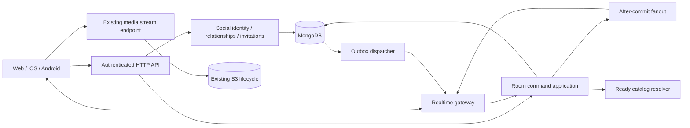

# Architecture and operational contracts

This document describes implementation boundaries and recovery contracts. Product
behavior remains defined in [business-rules.md](business-rules.md).

## Social identity and relationship API

The Stage 2 backend is implemented in `src/application/social/socialService.ts`,
`src/contracts/socialV1.ts` and `src/routes/socialRoutes.ts`. This is additive to
listener-v1 and private account APIs. `FINITUDE_SOCIAL_ENABLED` defaults to false;
setting it to exactly `true` enables admission. Disabling it retains reads and
safety actions, including changing an existing profile to undiscoverable without
changing its handle/alias or losing friends. No room endpoint or delivery worker
is enabled by this flag.

### Routes and projections

All routes below are relative to `/api/social/v1`. They require a current revocable
session; native Bearer and current-viewer-bound browser cookie requests use the
existing authentication and same-origin policies. The router authenticates before
its strict 4 KiB JSON parser. It returns private/no-store responses and never raw
database documents. Unknown JSON/query fields and repeated query values fail.

| Method and path | Input | Response |
| --- | --- | --- |
| `POST /mutation-scopes` | Empty JSON object | `{scopeToken, expiresAt}` |
| `POST /mutation-outcomes` | `{scopeToken, commandId}` | `{outcome: SocialOutcome or null}`; expired signed scopes may query retained outcomes |
| `GET /me/profile` | No query | `{profile: SocialOwnProfile or null}` |
| `PATCH /me/profile` | Mutation identity plus `handle`, `alias`, `discoverable`, `expectedRevision` | `SocialOutcome`; creates with revision 0 or updates/reactivates the observed revision |
| `POST /me/deactivate` | Mutation identity | `SocialOutcome` |
| `GET /profiles?handle=...` | Exact normalized handle | `{profile: SocialCard or null}`; hidden/missing/bilaterally blocked are identical |
| `GET /relationships?kind=...` | `kind`: friends/incoming/outgoing/blocks; optional limit 1–50 (default 20), signed cursor | `{items, nextCursor}`; no total count |
| `GET /relationships/:socialId` | No query | `{relationship: {socialId,state,revision} or null}`; state is none/incoming/outgoing/friends/own blocked |
| `POST /friend-requests` | Mutation identity plus `targetSocialId`, `expectedRevision` | `SocialOutcome` |
| `POST /relationships/:socialId/:action` | Mutation identity and observed `expectedRevision`; block omits revision | `SocialOutcome`; action is accept/decline/cancel/remove/block/unblock |

A mutation identity is `{scopeToken, commandId}`. Command IDs contain 16–80 ASCII
letters, digits, underscores or hyphens. The server normalizes a handle to lower
case, trims/NFC-normalizes aliases, rejects control/format characters, and checks
all fields before capturing immutable intent. Scope tokens are authenticated,
account-bound, expire after 24 hours and are never accepted in a query string.
They are domain-separated from both access tokens and list cursors. A signing-key
rotation invalidates scopes/cursors rather than weakening verification.

`SocialCard` contains exactly `socialId`, `handle`, `alias`, and `iconSeed`.
`SocialOwnProfile` additionally contains `active`, `discoverable`, and `revision`.
List rows contain `socialId`, a permitted `profile` card or null, and the
relationship `revision`. Block-list cards are always null: retaining a private
block reference never grants current profile access. A peer's private block is
not disclosed by pair-state or unblock precondition errors. Existing friends and
pending-request participants may read their relationship despite discovery opt-out;
an unrelated hidden or inactive target returns null.

Completed mutation attempts return HTTP 200 with
`{commandId, outcome: applied|noop|rejected, code?, replayed}`. A rejected domain
outcome is durable and must be handled explicitly. The social router's errors use
HTTP 400/401/404/409/410/413/415/429/503 for invalid schema, session, missing route,
idempotency conflict, expired scope, body/type, admission budget or infrastructure
failures, with generic `{code,message}` bodies. Shared authentication, viewer,
Origin, TLS and concurrency guards retain their existing HTTP status and error
envelopes, which may contain only `message` (including 403 and 426). Clients must
handle the status even when a social error code is absent. A successful HTTP
response alone does not mean that the requested relationship was applied.

After cancel/decline/remove/unblock, the pair may remain as a positive-revision
`none` tombstone. Before an explicit new request, read the authorized pair-state
endpoint and capture its revision; do not guess 0 or automatically rebase a failed
command. Revision 0 denotes a currently absent pair. These numbers can skip: they
are mutation preconditions, not item counts or continuous client event sequences.
Cursor signatures bind the viewer and list kind for 15 minutes. Each page freshly
projects visible rows in opaque social-ID order; it is not a retained list snapshot.

### Direct music share API

`src/contracts/socialMusicV1.ts` defines a separate private projection. These
routes reuse social-v1 authentication, viewer fencing, 4 KiB JSON limits,
mutation scopes, status-only receipts and payload-free `socialChanged` delivery.

| Endpoint under `/api/social/v1` | Contract |
| --- | --- |
| `GET /music-shares?direction=incoming\|outgoing&limit=20&cursor=...` | `{ items, nextCursor }`; default page 20, maximum 50; signed cursor binds account, direction and descending creation time/share identity for 15 minutes |
| `POST /music-shares` | Original mutation identity, `targetSocialId`, observed friendship `expectedRevision`, `contentType: audioTrack\|album` and catalog `contentId` |
| `POST /music-shares/:shareId/dismiss` | Original mutation identity; only the recipient removes this share incarnation |
| `POST /music-shares/:shareId/withdraw` | Original mutation identity; only the sender removes this share incarnation |

Items contain only opaque `shareId`, the peer's current social card, catalog
type/identity, creation/expiry timestamps, and current allowlisted content
(`id`, `contentType`, `title`, `artworkUrl`, `artistNames`) or null. No stream URL,
account ID, saved state, read/play receipt or historical identity is retained.
Reads recheck both active profiles, current friendship, blocking and ready
catalog visibility. Replacements resolve current catalog identity. Deleted or
non-ready content returns null until indexed idempotent cleanup removes its rows.

The `socialMusicShares` collection bounds each account to 100 live incoming and
100 live outgoing rows, with a durable 50-new-incoming/day budget and 30-day
logical expiry. Current duplicate sender/recipient/content shares are noops.
Account fences serialize quota, friendship and catalog-reference admission with
the existing transaction executor. Removal/block/deactivation/account deletion
clear the affected bounded rows and invalidate surviving peers. Catalog deletion
reclaims indexed references in bounded retryable batches before final metadata
removal. TTL only reclaims expired rows and never grants visibility.

Web's lazy `/finitude/social/shares` route and share dialog use the existing player
and private Save API. Their shared operation session retains an uncertain command
across route/dialog changes, blocks a new share until explicit recovery, and
fences late callbacks to the captured account epoch. Acknowledged writes remain
acknowledged even if the subsequent list refresh fails.

### Friend listening status API

`src/contracts/listeningV1.ts` adds an independent opt-in Audio projection under
the same live session, current viewer, exact JSON and cookie protections.

| Endpoint under `/api/social/v1` | Contract |
| --- | --- |
| `GET /me/listening` | `{ listening: { enabled, revision, publisherRevision, serverTimeMs } }`; absent preference is off at revision 0 |
| `PATCH /me/listening` | Original social mutation identity, `enabled`, observed `expectedRevision` |
| `POST /listening-publications/claim` | Original social mutation identity, document `clientId`, `expectedPreferenceRevision`, `expectedPublisherRevision`; status-only receipt, no public playback |
| `POST /listening-publications/report` | Exact publisher identity, expected preference/publisher versions and increasing `sequence`; `playing` carries `observedAtMs` and captured playback; `stopped` carries its captured `occurrenceId` and `playbackSequence` |
| `POST /listening-status/query` | `{ socialIds }`, 1–50 unique already-observed opaque IDs; `{ items }` contains only current friend cards, ready Audio metadata and expiry |

The durable `socialListeningStates` account row keeps the preference and publisher
clock. One `socialListeningPublications` row per account holds the current session,
document client, claim command ID, sequences, loaded-source fingerprint, playback
occurrence and expiring display. A claim advances the clock and publishes nothing.
Reports update an existing exact lease and never upsert. TTL can reclaim the
publication without removing the durable clock or allowing an old receipt/report
to recreate it. The claim's `commandId` is its private publication identity.

Playing reports include `sourceId`, `occurrenceId`, `mediaTrackId`, `positionMs`
and nullable room evidence (`roomId`, epoch, member/controller, playback generation,
entry and pinned media revision). The per-document client matches the room client.
Ordinary Audio uses the current ready source without requiring room WAV analysis.
The source ID survives pause/buffering recovery; a new actual run changes the
occurrence. Same-source resumes retain the source fingerprint, preventing an old
loaded source from rebinding to replaced media inside its lease. Room reads and
reports also verify current authority, admission, controller, readiness and the
exact playing timeline. These private fields never enter friend projections.

Native `playing` establishes source-matched proof; only fresh advancing native
media time can renew it. An observer remounted during continuing Audio can also
recover after a new explicit gesture and two fresh, advancing, source-matched
native observations. A source change retires that recovery gesture. The lazy
observer does not trust UI status, readiness or the `play()` promise.
Client monotonic observations are mapped to server time from
owner reads. Delayed responses cannot rewind the established clock estimate;
preference and publisher revisions are still applied, and clock advances recheck
the existing lease expiry. Reports more than five seconds old or two seconds ahead are rejected;
expiry is bounded by observation time plus 25 seconds. Same-occurrence renewals
extend at most every ten seconds; valid early/nonadvancing reports may acknowledge
their sequence while retaining the previous expiry. The playing-report budget is
60 per account per minute; captured safety stops remain available after that
budget is exhausted. Existing IP/session protections still apply.

The visible 20-friend page polls every five seconds, reuses the account publisher's
monotonic server clock, expires rows locally and hides failed reads. Changing pages
replaces the queried set. Claims and reports do not fan out generic social invalidations. Current
friendship, active profiles, opt-in, unblocked relationships, publishing session
and ready source are rechecked on each read. Source replacement is an immediate
visibility/renewal barrier; indexed cleanup before final source deletion uses
bounded batches rather than an unbounded publication update in the source
transaction. Session revocation includes ordinary publishers that never joined
a room. Opt-out/deactivation invalidate publication and retain clocks; final
account deletion removes both private records. Disabled social admission hides
status while preserving setting reads and safety cleanup.

The Web account singleton retains uncertain preference/claim identities across
route changes. A new explicit gesture freshly verifies the publisher; automatic
progress, reconnect and polling cannot reclaim another device's ownership. Stops
capture their original lease, sequence and occurrence. Account transitions
synchronously detach observations, and late callbacks cannot publish for a new
viewer. Creating a paused room and inviting a friend are separate explicit,
recoverable mutations with no automatic playback.

A stop records the sequence of the playing report it cancels, below its own
sequence. This lets a stop arriving before that playing report suppress both the
pending occurrence and older display, without allowing a delayed old-occurrence
stop to clear newer playback. A room member's confirmed local pause/disconnection
also clears its matching publication and blocks the retired actual occurrence;
readiness recovery alone cannot restore that display.

### Transactions, budgets and lifecycle

Social reads/writes verify the actor's account-bound, unrevoked and unexpired
`authSessions` row inside their transaction. A conditional session-row increment
serializes with revocation. Involved account rows are fenced in sorted order before
reading the final domain state. Each write commits the domain state, status-only
receipt and payload-free invalidation together. Production transaction bodies
perform no external dispatches. Known-aborted transient conflicts have at most three
attempts with short backoff; a commit with an unknown result returns
`mutation_outcome_unknown` and is never automatically rerun.

Receipts are keyed by account, signed scope ID and command ID; a canonical digest
detects changed intent. Identical retries are deduplicated before stale revision
checks and return only the recorded status, never old profile/relationship data.
Explicit same-identity retry resolves an uncertain commit. Receipt expiry is one
hour after scope expiry. Expiry is checked logically, even if TTL has not run or
the receipt was already removed. A failed outcome lookup does not authorize a
new-scope replay.

Durable budgets are 24 scopes/day, 30 new mutation attempts/minute and 120 reads/minute
per account, plus 100 newly received requests/day. Profile deactivation cannot reset
these counters. IP throttling and mutation concurrency limits provide additional
request protection. Retained receipts permit 1,000 admission attempts plus 128
safety receipts and a final reserved deactivation receipt; admission exhaustion
therefore cannot consume the privacy-exit reserve. Retries consume no new receipt.
Short request-rate limits still apply to safety operations.

Each canonical pair stores both account/social IDs, independent directional
blocks, request direction, state and revision. Friends/pending/blocks/pair bounds
are checked under both account fences. Unblocked `none` tombstones have a 25-hour
expiry. Durable per-account relationship clocks survive their cleanup, ensuring
a recreated pair never reuses a previous request revision. Those clocks also
advance during deactivation. They are internal fields, not public profile data.

The social outbox is one coalesced row per account: account ID, invalidation
revision and update time. It retains no peer, alias or relationship payload and
has no TTL that could erase pending recovery work. The room gateway reauthorizes
delivery from these current-state markers. Scope receipts likewise contain no
peer reference or private projection, so deleting a target cannot leave cached
identity payload in another account's receipt.

Account deletion keeps the existing synchronous transaction and all avatar/shared
provenance preconditions. `socialAccountLifecycleService.ts` removes the deleted
account's profile, both-sided relationships, receipts, budget and outbox, fences
existing peers before their invalidation, and removes the owner identifier from
the 30-day handle reservation. Concurrent peer deletion cannot recreate orphaned
outbox data. A failure rolls back the entire cleanup; no S3 object is touched.
Deactivation retains the profile/handle, blocks, receipts and clocks so later
reactivation cannot restore an old intent or relationship.

Startup migration `required-indexes-v4-social-participation` adds mandatory unique constraints
and required nonunique cleanup indexes. A sparse, partial, hidden, wrong-key or
wrong-uniqueness substitute is rejected. TTL is opportunistic reclamation and is
never an authorization or admission decision. See the active plan for actual
verification and the remaining client/room rollout stages.

## Social and shared playback architecture (proposed)

The architecture below includes later native, Video and deployment stages.
The current implemented Web Audio slice is defined by the following contract and
[canonical business rules](business-rules.md#shared-playback-rooms); remaining
proposals must not be read as already delivered capabilities. The active
[implementation plan](plans/social-and-shared-playback-plan.md) retains the
unverified device and rollout gates.

### Implemented Audio room API

`src/contracts/roomV1.ts` freezes the runtime wire contract; the earlier
`roomPlaybackPrototype.ts` remains a test feasibility model. Finitude Web's
`/finitude/social` route uses `web/src/api/rooms.ts`, optional discovery reads in
`web/src/api/roomMedia.ts`, `roomSession.ts`, and the
existing player through its lazily loaded room adapter. Native adapters still
use synthetic DEBUG fixtures and do not consume this API yet.

All endpoints are private, require a live revocable session and current Web
account viewer, reject extra query/body fields, and return allowlisted DTOs.
Cookie writes retain the existing same-origin JSON protections. Room HTTP bodies
are capped at 16 KiB; social identity bodies remain capped at 4 KiB.
`X-Finitude-Room-Client` identifies a fresh tab lifetime, not authorization.

| Endpoint under `/api/social/v1` | Contract |
| --- | --- |
| `GET /capabilities` | `socialEnabled`, `roomsEnabled`; room admission requires both flags |
| `GET /rooms/current`, `GET /rooms/:roomId` | `{ room: snapshot or null }`, always freshly authorized |
| `GET /room-media` | `{ items }`, at most 100 eligible pinned Audio descriptors |
| `GET /room-media/search?q=&cursor=&limit=` | `{ items, nextCursor }`, title substring search; default 20/max 50 eligible pinned Audio descriptors per page |
| `GET /room-media/:mediaTrackId` | `{ item: descriptor or null }`; current active social profile required; missing and ineligible tracks are indistinguishable |
| `GET /room-invitations` | `{ invitations }`, up to 20 current authorized invitations with inviter card, incarnation and expiry; a bounded preview, not an exact total |
| `GET /room-invitations/:invitationId` | `{ invitation: invitation or null }`, original recipient only; unavailable, expired, replaced, revoked and wrong-account links are indistinguishable |
| `GET /rooms/:roomId/invitations` | Current host/controller only; `{ invitations }` containing only `invitationId`, `generation`, `recipientSocialId`, `expiresAtMs` for pending links |
| `GET /rooms/:roomId/community` | Current members only; `{ community }` with room/epoch/revision, up to 20 pending song requests, current-member queue attribution and up to 20 unexpired activity events within 64 KiB |
| `POST /room-commands` | Strict command with original `scopeToken` and `commandId`; status-only social outcome |
| `POST /realtime-tickets` | `{ clientId }`; returns an opaque single-use 30-second ticket |
| WebSocket `/realtime` | Same-origin upgrade, subprotocols `archtree-room-v1` and ticket; only the protocol name is negotiated |

Room media search trims the query, limits it to 100 Unicode characters and
rejects control characters. Title matching treats regex syntax literally.
Descending-ID keyset cursors are signed, account/query bound and expire after
15 minutes. Each page resolves at most 200 candidates; a partial or empty page
may still provide `nextCursor` so older eligible tracks remain reachable. Reads
never analyze or mutate media. The original bounded `/room-media` response stays
available for older Web clients; current pickers use search and pagination.

Tickets never appear in URLs and only their SHA-256 digest is persisted. Issue
and redemption transactionally fence the live account/session. At most five
pending tickets per account are retained. Expiry is checked logically before
any TTL reclamation. The gateway reauthorizes complete state after every committed
invalidation and periodically every five seconds to recover a lost final wakeup.
Outboxes store only invalidation versions, never historical private room payloads.

Invitation list, detail and outgoing projections share current room, host,
profile, friendship and logical-expiry checks. Recipient previews filter before
filling 20 results, with candidate scanning bounded by total room admission
capacity. Detail lookup is independently recipient-scoped, so an older valid
link does not depend on appearing in that preview. Copying a link performs no
mutation: the host reads current outgoing metadata after the original status-only
invite outcome. Reinviting mints a new invitation ID, and old receipts do not
recover a historical URL. Acceptance still uses the original scope/command ID and
the freshly read invitation generation.

The lazy Web global invitation entry shares the room-session singleton with room
pages. It refreshes on a fresh subscription, `socialChanged`, explicit mutation
settlement, focus and a 15-second fallback. Local expiry timers handle TTL deletes
that produce no outbox bump. Queries and deferred UI callbacks remain scoped to
the current account epoch, and the existing session privacy barrier hides them
during identity transitions. This is a pending-action indicator, not a durable
notification inbox or read-status model.

Community reads preserve the strict room-v1 playback snapshot and WebSocket
schemas. Song requests retain a bounded pending member incarnation and pinned
media identity within the room aggregate. Acceptance revalidates that exact
representation and appends one queue occurrence. Host queue edits carry the
observed epoch, controller, permission, playback and queue versions; stale edits
fail without becoming new commands. Editing another entry preserves the current
timeline and readiness barrier. Community changes advance the existing room
revision/outbox; the visible community query coalesces snapshot-driven refreshes
without reloading unrelated social lists. Explicit community commands also
invalidate only that account's community queries. Member removal clears requests
and attribution; media invalidation includes request-only references through the
required `socialRooms.songRequests.mediaTrackId` index.

The `react` member command carries `expectedEpoch` and one token from
`heart`, `clap`, `fire`, `smile`, `music`. It uses ordinary admission and immutable
receipts, independent of controller/playback permissions. Durable account and
room counters enforce 12 and 60 accepted reactions per minute. Internal activity
records retain only an event identity, fixed kind/reaction, membership incarnation
and 30-second expiry. Read projection resolves current social cards, omits departed
actors and trims the oldest events to preserve the existing response byte bound.
Only automatic track advancement uses a null actor. Event append never changes
playback, control or queue generations. Initial/reconnected clients seed existing
event IDs without repeating live announcements; local timers enforce expiry even
when no room revision changes.

Client frames are `ping` with `clientTimeMs` and an optional exact membership /
controller / local-pause heartbeat, or `ready` with an exact readiness report.
Server frames are `subscribed` (protocol, server time, initial room), `snapshot`
(complete current room or null), `pong` and `socialChanged`. Clients never submit
transport commands through WebSocket, and snapshots never generate commands.
Frames are capped at 2 KiB inbound and 64 KiB outbound, reports at 120/minute,
per-connection pending work at eight and output buffering at 128 KiB. The initial
gateway caps 256 connections, 32 per IP and four per account, with 32 pending
upgrades. These are admission bounds, not measured production capacity.
Transient snapshot-read contention receives at most three fresh authorized reads
with bounded backoff. It does not retry playback commands or deliver a cached
projection. Revoked access and lost authority close immediately; exhausted
availability repair closes with retryable WebSocket code 1013.
Known-aborted heartbeat/readiness reports use the same bounded retry while keeping
their original occurrence and sequence; uncertain commits are never replayed.
Stale controller reports refresh authorized state. A timer sweep may defer two
consecutive availability failures only after freshly validating the lease; the
third failure closes connections. Each later tick captures its own observation.

Create takes an explicit ordered `mediaTrackIds` selection. Other actions are
`acceptInvitation`, `declineInvitation`, `leave`, `end`, `takeControl`, `invite`,
`kick`, `offerTransfer`, `acceptTransfer`, `cancelTransfer`, `setControlMode`,
`requestSong`, `dismissSongRequest`, `acceptSongRequest`, `removeQueueEntry`,
`reorderQueue`, `react`, `play`, `pause`, `seek`, `next`, `previous` and `select`. Shared transport captures
room epoch, membership/controller generation, control generation, playback
generation, queue revision and current entry. Its immutable identity and observed
versions survive an explicit same-intent retry. A losing command never rebases
itself onto a newer playback occurrence. Host queue edits use the same observed
queue/playback preconditions and preserve the currently playing occurrence.

A complete snapshot includes authority/room/control/queue/playback versions,
version-pinned entries, authoritative timeline, preparation cohort, member cards
and self controller permissions. `serverTimeMs` is an observation; timeline anchors
are absolute server time. Web calibrates its monotonic clock with ping RTT,
preserves the converted anchor on unrelated membership revisions, applies a
350 ms scheduled lead after preparation and performs bounded drift correction.
Actual speaker/output alignment remains a target-environment measurement.

Preparation lasts at most three seconds. Readiness fences exact room epoch,
member/controller, preparation ID, playback generation, entry and media revision
plus a monotonically increasing report sequence. Preparation completion preserves
that playback generation. Reserved `preparationId: "current"` reports a late or
resynchronizing player's readiness only when no preparation is active and the
exact timeline is playing/paused; it does not restart or move the timeline. The
local player remains silent until its own readiness acknowledgement is visible.
Local pause, disconnect, takeover and revoked controller sessions clear readiness.

`socialRooms` is a bounded aggregate (eight members, 100 entries, 100 active rooms
per deployment). An account-keyed participation row enforces one active room.
MongoDB transactions arbitrate commands, receipts, graph/account fences, source
reference touches, membership, readiness and timers. A deployment-wide 10-second
MongoDB authority lease renews every three seconds; every authority mutation
conditionally writes its live owner/epoch fence using MongoDB time. Takeover
increments the epoch and pauses recovered playback. Safety removal never needs a
leader. This initial deployment requires traffic to reach the lease holder;
per-room routing, distributed fanout and sharding are future capacity work.

Host-only is the default, invites last 24 hours, transfers last 30 seconds,
host grace is 30 seconds and host absence closes after five minutes. A sweep
runs every 250 ms, validates stored session/source state and logically expires
24-hour rooms before releasing participation. Closed rooms have member/queue
identities scrubbed transactionally and expire after 24 hours. Invitation TTL
reclaims expired offers, and room-outbox hints expire after 24 hours. No TTL may
delete an active aggregate before its participation cleanup.

Media analysis accepts complete PCM16 WAV, mono/stereo 8–48 kHz, with a finite
verified duration no greater than 24 hours. A private representation records
opaque revision, duration, seek eligibility and S3 validators, atomically promoted
with the active object. Public descriptors contain only ID/title/duration/revision
and `/content/mediaTrack/stream/:id?revision=mr_...`. Revision-fenced HEAD/GET pin
ETag/VersionId, recheck the ready representation after storage I/O and reject
stale bytes. Replacing/deleting a source marks old room entries unavailable in
the source transaction. Versionless ordinary streaming retains its contract.

Web room playback does not write Recently Played in this slice. Joining replaces
the executable queue through the existing player; leave/removal detaches the room
and clears the queue without restoring or resuming an earlier queue. Browse playback cannot silently
replace a joined room. Hidden Web Audio tabs continue using fresh authorized
snapshots; visibility alone is not a local pause. Document freeze or pagehide
invalidates the transport incarnation and detaches playback. Resume/pageshow
obtains fresh authorization, while a visibility return also checks both monotonic
and wall-clock pong age against the 15-second freshness bound. Personal resumption
remains explicit. A local Play gesture captures its original command preconditions,
clears the caller's local pause, and waits for the matching heartbeat pong before
sending shared Play, so the HTTP command cannot overtake cohort admission. New
local pause, account/controller/transport changes, or superseded preconditions
cancel that pending gesture; temporary suspension retains uncertain command keys.
Host-control guest Play only resumes personal readiness. Native background operation, downloaded-source preference,
Video capability negotiation, broader audio decoders, queue editing, push
notifications and deployment load evidence remain later stages.

Social and room database transactions allow six total attempts for confirmed
transient aborts or duplicate-key contention. Five waits use 50/100/200/400/600 ms
plus 0–49 ms jitter each (at most 1,595 ms of intentional backoff, excluding
transaction execution). The parsed command and its expected versions stay fixed.
Unknown commit results and post-commit failures are never automatically replayed;
the client retains the original command for explicit outcome checking or retry.

### Existing foundation and compatibility

The repository already supplies Express/Node, transaction-capable MongoDB,
account/session fences, ready-only catalog projections, and identity-bound S3
media delivery. `src/server.ts` attaches the optional authenticated WebSocket gateway using `ws`;
Redis is not required for the initial single-authority implementation.

`src/routes/feedRoutes.ts` restricts publishing to administrators. A Feed Post
author ID is attribution, not a social profile. Playlists are private and
owner-only; avatar bytes are private. The separate Artist Follow plan describes
a private catalog subscription, not a person-to-person relationship. None of
these surfaces becomes social by changing its existing authorization guard.

Audio and Video already share one MediaTrack identity and stream endpoint.
Web uses `web/src/player/playerStore.ts`; iOS uses `AudioManager.swift` with
its shared transport and video projection; Android uses `PlaybackController.kt`
with its app-owned Media3 player. Shared playback adds an orchestration adapter
to those owners. It does not create another media player. Local playback remains
the default mode for clients that do not adopt the new versioned protocol.
The initial review found that Web's transport exposed playback rate as read-only,
iOS lacked scheduled-start/rate control, and Android connected MediaSession
directly to its ExoPlayer and installed an automatically advancing queue. Stage 1
adds isolated feasibility adapters at those seams; this does not enable room
admission or establish production synchronization guarantees. Complete the
three-client evidence and capability fallbacks before freezing the protocol.

### Implemented feasibility boundary

`src/contracts/roomPlaybackPrototype.ts` validates the provisional synthetic
snapshot/command shape. `src/application/rooms/roomPlaybackPrototype.ts` implements
a pure version-fenced transition function and a bounded in-memory authority for
tests. Competing commands consume the same playback generation once; receipts
deduplicate identical intent without returning historical room snapshots. The
prototype models both permission modes and control-generation fencing.

There is no production route, authentication boundary, signed mutation scope,
database transaction, outbox, authority lease or preparation coordinator in this
prototype. In-memory admission demonstrates deterministic arbitration, not
durability or distributed concurrency safety. The later repository must preserve
the original command preconditions across transaction retries.

`contracts/social/prototype-v1/playback-trace.json` is the exact shared synthetic
corpus for backend and three-client tests. Its duplicate, stale, membership-only,
playing and seek frames exercise the existing player through opt-in adapters.
Client adapter types are local normalized inputs, not a released wire protocol.
The active plan records platform checks and remaining physical-device, clock,
media-lifecycle and background-execution gates.

### Scope and module boundaries

Recommended first experience: opt-in social identity, mutually accepted friends,
block controls, account-targeted invitations, and private rooms for 2–8 people.
Ship an Audio room first, then enable Video on the same room protocol after
device evidence. Public discovery, follower counts, user posts, comments, direct
messages, collaborative Playlists, live broadcasts, and voice/video calls are
separate later product decisions. A room does not require a public social feed.



All boxes except clients, MongoDB, and S3 are initially modules in Archtree.
HTTP owns durable commands and snapshot reads; WebSocket pushes current room
snapshots, clock samples, and bounded presence/readiness reports. Both invoke
the same authorization and room application services. v1 has one command ingress,
not competing HTTP and WebSocket mutation implementations. Reconsider WebSocket
commands only if measured HTTP overhead matters; preserve the same command
envelope and application handler. Audio/video bytes never traverse the gateway.

| Module | Responsibility | Boundary |
| --- | --- | --- |
| Social identity | Explicit social alias and discoverability, allowlisted viewer-dependent projection | Never project the raw User model, email, private avatar, saves, or activity |
| Relationships | Requests, accept/remove, bilateral block checks | Person relationships remain separate from private Artist Follow |
| Invitations | Recipient-bound, expiring, revocable room admission | Knowing a room ID or invite ID grants no access |
| Rooms | Membership, host role, queue, authoritative timeline, revision | Room roles grant no catalog/admin rights |
| Realtime | Authorized delivery, reconnect, ephemeral connection state | Socket connection is neither durable membership nor proof of playback |
| Notifications | Durable in-app invitation outcomes and read state | No email/push dependency in v1; recheck access when opening |
| Safety | Block, host removal, invitation throttles, operational abuse handling | Applies to HTTP, subscriptions, replay, notifications, and admission |
| Player adapter | Translate room state into existing transport operations | System controls and queue advancement go through the same mode boundary |

Code seams are `src/contracts/socialV1.ts`, `src/application/social/`,
`src/application/rooms/`, `src/repositories/social/`, and `src/realtime/`.
Social and Audio room contracts, transactional application services, repositories
and the authenticated realtime gateway are implemented. The isolated arbitration
prototype remains a feasibility fixture alongside the production room service.
Transport adapters must not contain independent business rules.

### Identity, relationships, and access

Use a separate opt-in social profile with a new opaque social ID mapped internally
to the existing account. Start with a listener-chosen alias and generated icon.
Do not derive social initials from email or expose the existing private avatar.
Exact social-handle lookup is opt-in, authenticated, bounded, and rate-limited;
it reveals only social ID, handle, alias, and generated icon, even to a non-friend. This
minimal discovery card is distinct from profile access granted by friendship or
active room membership. Pending requests have their own allowlisted alias-card
projection; sending a request cannot unlock additional recipient fields. Do not search registration
identifiers or implement email/contact discovery. Account IDs remain internal;
client member/relationship references use social IDs and membership IDs.

Turning discoverability off prevents new lookup but preserves existing friends.
Deactivating the social profile cancels requests/invitations, removes friendships,
leaves or ends rooms, and revokes social subscriptions before hiding the profile.
Retain owner-private blocks until explicit unblock or account deletion; reactivation
does not restore friends, invitations, or membership. The implemented identity
contract above fixes handles for the account's lifetime and reserves a deleted
handle without its former owner ID for 30 days. Cached handle text can never
substitute for the immutable social ID when accepting an invitation. Room and invitation cleanup now shares the account/social transaction.

Recommended relationship state machine: `none -> pending -> accepted -> none`.
Decline/cancel removes pending access. Crossing requests do not auto-accept;
acceptance must be explicit. One normalized unordered account pair is unique;
each party's directional block state is independent. Unblock restores no prior
request, friendship, invitation, or membership. Blocking atomically cancels
pending requests/invitations, removes friendship, and denies future interaction.

For the small-room v1, any blocked pair is forbidden from co-membership. Reject
admission without revealing which member blocked whom. If members block while
already together, remove the blocked member when the blocker hosts the room;
otherwise remove the blocker, including when the blocked person is host. Apply
the room change in the same serialized operation as the block, and close affected
subscriptions. This is the implemented small-room policy.

An invitation targets one account and one room, expires after a proposed 24 hours,
and is consumed atomically with admission. Accept checks active account, current
friendship with inviter, inviter's invitation permission, blocks against every
member, room state, capacity, and expiry. Replayed acceptance returns the original
result status; any private projection is freshly authorized. Removed membership
is never resurrected by replay. The room host invites in v1. Friendship removal
revokes unused invitations but does not silently end
existing membership; explicit leave, kick, block, or room end does that.
Invitation previews expose only the inviter's consented discovery card, expiry,
and invitation status; membership lists, queue and current media require admission.

The implemented social limits include 500 friends and 50 combined incoming and
outgoing pending requests per account. Proposed room limits are 20 outstanding
invitations per host, one joined active room per account, eight
members per room, and 100 queue entries. Enforce limits transactionally; revise
them only with measured capacity and UX evidence. Apply both sender and recipient
abuse controls so one account cannot flood another through repeated operations.

### Room permissions and host management

Rooms support `hostOnly` and `everyone`; the proposed creation default is
`hostOnly`. Only the current host can change mode, and the server-confirmed mode
is visible to every participant. The setting applies to shared transport, not
room administration:

| Action | Host control | Everyone control |
| --- | --- | --- |
| Shared Play/Pause/seek/Previous/Next/select existing queue entry | Host's active controller | Every admitted participant's active controller |
| Change mode, invite/kick, add/remove/reorder/share queue items, transfer host, end room | Host only | Host only |
| Volume, mute, explicit Pause on this device, local resync, leave | Each participant for themselves | Each participant for themselves |
| Recommend Audio, withdraw one's own recommendation, send a fixed reaction | Every admitted member, including observers | Every admitted member, including observers |
| Observe playback from a secondary device | Read-only playback | Read-only playback |

Persist `playbackControlMode` and a monotonic `controlGeneration`. A real mode
change or host transfer increments that generation and room revision. Commands
check both the expected control generation and current role/mode in the same
transaction as the playback mutation. Concurrent controls and a mode change
commit in a definite order: a previously committed action remains valid, while
a later stale command is rejected without automatic replay. Toggling back to
Everyone never revives an old command. A same-mode no-op does not bump versions.
All members' seek gestures submit only the final position on release; simultaneous
commands based on one playback generation yield one winner and explicit stale
results, not repeated automatic seeks. Retain per-member and per-room rate bounds.

Changing mode alone preserves the active timeline and an already accepted
preparation. Server completion of that recorded intent remains fenced to its
preparation/playback identity; it is not permission to admit another stale member
command. Pending controls are cleared when permissions change. Shared controls,
system controls and fullscreen controls must show the same effective permission.
Explicit local pause remains a separate action in both modes and requires local
resume/resync before that device participates again.

The proposed host exit UI has two distinct actions:

- **Transfer and leave:** choose a current participant with a live controller;
  that participant explicitly accepts a short-lived offer. Atomically install
  the new host and remove the old host's membership/participation slot. A rejected,
  expired or failed transfer does not silently remove the old host or close the
  room. A remaining lone member may become host; no second guest is required.
- **End room for everyone:** close the room and detach every member. When no
  eligible recipient exists, this is the available host-exit action. A plain
  host-leave API cannot disguise this consequence as a guest leave.

An offer is bound to the current host/control generation, target membership and
controller generations, proposed leave-after-transfer action and server expiry
(initially 30 seconds). Cancel/replace offers explicitly; acceptance rechecks
host authority, target presence/session, blocks, account state and room state.
Removal, rejoin, mode change or controller takeover invalidates a stale offer.
Uncertain acceptance uses its original mutation scope/command ID for outcome
resolution. A competing End room is serialized with acceptance and cannot close
a room after the sender has lost its host role.

Successful transfer preserves playback mode, queue and an already running media
timeline, cancels old-host invitations, and broadcasts the new host. If preparation
is still pending, cancel it under a new playback generation and pause; the new
host explicitly resumes with a fresh readiness round. The previous host never
regains the role merely by reconnecting. There is no automatic host promotion in
v1; absence handling below applies equally to both permission modes.

### Persistence and atomic boundaries

| Proposed collection | Main data and required constraints |
| --- | --- |
| `socialProfiles` | Unique account ID, unique normalized social handle, separate unique social ID, visibility revision |
| `socialRelationships` | Unique canonical pair, request initiator/status, directional blocks, revision; indexes for either participant |
| `socialInvitations` | One unique room-recipient row, invitation generation, inviter, logical expiry/state; reissue advances generation and invalidates prior acceptance |
| `socialRooms` | Host, playback control mode/generation, optional transfer offer, bounded memberships/queue, timeline/preparation, authority epoch, room/queue/playback versions, controller generations, host-absence deadline/suspension, expiry |
| `socialRoomParticipation` | Unique account ID pointing to active room; updated atomically with membership to enforce one-room limit |
| `socialMutations` | Unique actor/mutation-scope/command ID, operation and canonical request digest, result status, retention deadline |
| `socialOutbox` (implemented) | One coalesced account-keyed invalidation revision, with no peer or historical payload |
| `socialRoomOutbox` (proposed) | Explicit room aggregate/epoch/revision/event kind and delivery attempt state; no retained room snapshot; separate from account-keyed social cleanup |
| `socialNotifications` | Unique recipient/event ID, allowlisted invitation reference, read state, expiry |
| `socialRealtimeTickets` | Unique hashed single-use ticket, account/session binding, consumed state, logical expiry |
| `socialAuthority` | One deployment-wide v1 room-writer lease, monotonic fencing epoch, owner nonce and lease deadline |

Keep small room membership and queue state in one bounded aggregate. Do not embed
unbounded relationships, rooms, or notifications into `users`. Create and verify
required unique indexes through the existing additive index catalog before flags
can enable writes. TTL indexes reclaim expired data but never decide access;
every request checks logical expiry itself. One room-recipient invitation row
avoids a time-dependent partial unique index, which the current required-index
verifier would reject. Old invitation generations survive only in bounded receipts.

Commands fence the active account, relevant relationships/catalog references, and
applicable room versions, then commit state + idempotency receipt + outbox record
in one MongoDB transaction. Block/admission races must write the same relationship
and room fences, including initially absent relationship pairs; snapshot reads
alone cannot prevent write skew. Use deterministic fence ordering and bounded
transaction retries. Only committed state is broadcast, outside transaction
callbacks that the driver may retry.
Unknown commit outcomes retain the same key for explicit same-intent retry. Key
reuse with a different body is rejected. Deduplicate before checking a retry's
now-stale expected revision, but recheck current visibility before returning a
stored result. Never replay private payloads to a removed member.

Every durable command also carries an immutable server-issued, authenticated mutation
scope bound to its account and a server-set expiry, initially 24 hours. Its
signature and expiry are checked on every attempt, even after receipts are gone.
The scope plus client-generated command ID identifies intent. Expired scopes
cannot execute; they permit only authorized outcome lookup while a receipt remains.
Clients must not refresh a scope and silently replay an uncertain old intent as
new. Retain receipts through scope expiry; bound issuance, command rates and
outstanding uncertain outcomes. This avoids treating an ancient purged UUID as
a brand-new mutation. Scope tokens are credentials and must not enter logs/URLs.

Immediately after commit, wake in-process fanout for the affected room. Normal
delivery does not wait for a polling interval. The durable outbox is the recovery
path with bounded polling, backoff, claim expiry, and at-least-once processing;
enqueueing a socket message is not proof that its recipient received it.
Coalesce room invalidations to the latest committed snapshot. Recheck current
account/session/membership visibility and project each recipient at send time;
discard queued projections when their access generation changes. Notification
workers also recheck access and deduplicate by recipient/event ID.

An acknowledgement confirms durable commit, not playback by everyone. A crash
between fanout and delivery marking may duplicate delivery; one after commit but
before fanout is recovered from the outbox. Store no historical room/member
payload for replay. MongoDB change streams may later wake the dispatcher but
cannot replace persisted recovery or a current authorized snapshot.

### Room protocol and ordering

Proposed endpoints, all private under `/api/social/v1`:

- `GET/PATCH /me/profile`; exact `GET /profiles?handle=...` lookup.
- `POST /friend-requests`; explicit accept/decline/cancel; idempotent friend
  removal and directional block/unblock resources.
- `POST /rooms`; `GET /rooms/:id`; `POST /rooms/:id/commands` for shared transport
  under the current mode; host-only mode/queue changes, invitations, kick,
  transfer offers and end; target-only offer acceptance; and each member's own
  leave action (with the explicit host-exit semantics above).
- `POST /invitations/:id/accept`; notification list and read-state mutations.
- `POST /mutation-scopes`; account-scoped outcome lookup for uncertain commands.
- `GET /rooms/:id/playback` for a validated, revision-pinned media descriptor.
- `POST /realtime-tickets`; authenticated bootstrap for `/api/social/v1/realtime`.

Freeze exact methods, errors, bounds, and fixtures in Stage 1 before implementation.
Durable domain mutations use the scope/command ID above; bounded authenticated
scope/ticket issuance is bootstrap and does not recursively require a scope.
Room transport commands carry authority epoch, membership/controller generation,
expected control generation, expected playback generation and expected current
queue-entry ID. Relative Previous/Next and queue edits also check the queue
revision whose order the user observed. Server transactions
still CAS the aggregate revision, but a heartbeat or unrelated member join does
not invalidate an authorized participant's Pause intent. Each committed visible state change
advances room revision. Safety actions such as leave/block/session revocation
do not require a fresh displayed room revision. Leave/kick/transfer fence exact
membership incarnation; a delayed kick cannot remove someone who later rejoined.
Transfer requires consent bound to the proposed host's membership generation.
Existing listener-v1 DTOs gain no social discriminators.

### Concurrent commands and feedback prevention

Capture the confirmed current entry and playback/control/queue versions at the
user-action boundary (seek gesture start or button/system-action activation).
Freeze that command envelope through asynchronous dispatch, retries and conflict
handling. A MongoDB transaction retry may refresh internal database reads but
must never substitute newer expected versions or reinterpret Next against a new
entry. The server conditionally commits the transition with its receipt and
outbox notice; the first commit wins for that playback generation.

For a queue A, B, C with A current at playback generation 41:

| Request | Server result |
| --- | --- |
| Participant 1: Next, expected entry A / generation 41 | Commit B in preparation at generation 42 |
| Participant 2: Next, expected entry A / generation 41 | Stale conflict, no playback write; resolve current authorized snapshot |
| Retry participant 1's original scope/command ID | Return its committed outcome status; no new transition |
| Fresh user action after observing B / generation 42 | May advance to C if all current guards still pass |

Both initial requests have distinct command IDs: idempotency alone cannot merge
them. The expected-state condition provides the one-winner behavior. A stale
request receives a controlled conflict such as `409 playback_state_changed`,
clears its pending UI and adopts current state. It never automatically sends a
new Next with updated versions. Queue reordering yields the corresponding stale
queue outcome rather than silently choosing a different successor.

Use two structurally separate client paths:

- `submitUserIntent`: invoked only by an explicit permitted UI/system action;
  creates one immutable command ID and envelope. One action delivered through
  multiple app handlers must still create one intent, not two commands.
- `applyRoomSnapshot`: sets the absolute authoritative entry, source, target
  position and state on the existing player. It never calls the command-submitting
  Next/Play/seek handlers. The originator applies its own server snapshot through
  this same path; ignoring only self-originated messages would not stop peers
  from echoing each other.

Readiness, progress, seeking/seeked, play/pause, buffering, item-change and ended
callbacks are observations. They may update local state or send bounded fenced
readiness/status hints, but never create shared transport commands. Keep source/
playback/application generations on asynchronous callbacks so late effects of an
old snapshot cannot affect a newer one. A short synchronous `isApplyingRemote`
boolean is insufficient because callbacks can arrive after it resets. Where a
native control exposes only an ambiguous state change, report divergence and
require explicit resync rather than infer a new user command from that callback.

Repeated equal/older snapshots are no-ops for transport as well as the UI; a new
membership-only room revision must not reload media or restart playback. Applying
a newer absolute snapshot may perform necessary bounded local correction but
cannot produce a network command. A server end timer and a manual Next compete
on the same playback occurrence; old client ended hints cannot advance the new
entry. At the end boundary the server resolves the current confirmed queue order,
and any transaction retry still preserves the timer's original playback identity.
An optional observed command ID helps resolve pending UI, not authorize replays.

### Room snapshots and controller ownership

Snapshots contain `protocolVersion`, `roomId`, `epoch`, `revision`, `serverTimeMs`,
`playbackControlMode`, `controlGeneration`, current host membership, host-absence
deadline/suspension, allowlisted members/roles and membership generations,
queue revision, ordered
`queueEntryId`/`mediaTrackId` pairs, and a timeline
`{playbackGeneration, entryId, mediaRevision, durationMs, state, positionMs, anchorServerTimeMs, rate}`.
The timeline is null before selection. An active preparation appears in full as
`{preparationId, playbackGeneration, entryId, mediaRevision, targetPositionMs, deadlineServerTimeMs, cohortMembershipIds}`;
it is null after cancellation/scheduling. The recipient-private `self` projection
supplies its membership/controller/access generations and permission/capability
state. A reconnecting client must be able to construct readiness solely from the
current snapshot plus its freshly resolved media descriptor, without an earlier
event. Clients cannot report readiness against a mismatched descriptor generation.
Only the current host and selected target receive the transfer offer's private
action projection; a full snapshot does not expose offer credentials to others.
Queue-entry identity distinguishes repeated playback occurrences. A media
revision is an opaque identity for the exact ready representation, never an S3
key. A distinct social-v1 playback descriptor supplies that revision, validated
numeric duration/seekability, media kind, and a version-pinned public stream URL;
old public listener DTOs and legacy streaming requests keep their contract.

v1 sends one complete room snapshot per state update, with a proposed 64 KiB
encoded cap enforced alongside the eight-member/100-entry bounds. It does not
send fragmented deltas or replay historical snapshots. Queue entries contain
bounded IDs/state; public artwork/titles load separately. Coalesced snapshots
may skip revisions because they are complete. Clients use one reducer for both
HTTP and WebSocket responses, ignoring older/equal revisions within an epoch.
After an acknowledged subscription, buffer bounded snapshots while fetching the
initial HTTP snapshot, then apply only newer states. Server-issued monotonically
increasing authority epochs and a local connection generation prevent old HTTP
responses or sockets from restoring a retired timeline. On a newer epoch, pause
and rebootstrap through the current authorized subscription before applying it.
An unsupported protocol/required capability produces an explicit unavailable
state and detaches room control; repeated snapshot fetches cannot fix it.

Presence/readiness reports use their own sequence and membership/controller/
preparation fences; heartbeats neither advance durable room revision nor write
per-second progress to MongoDB. Profile/alias changes that affect a room snapshot
advance its room revision through a room invalidation transaction. Heartbeat
responses include current durable revision to expose a missed final update. A
polling fallback can read authorized snapshots at a bounded, backoff-controlled
rate while the UI reports reconnecting; it does not advertise synchronized
playback, send readiness, or enable room transport commands. WebSocket recovery
requires a fresh subscription and readiness handshake.

One active controller device per account/room owns local readiness and the shared
commands its account is currently allowed to issue; another device may observe.
Explicit device takeover increments a
generation so the prior device cannot continue controlling. Multiple tabs do
not become additional members. Observers do not play the room stream or report
ready. A server/worker authority lease is separate from the human host role.
Even a one-instance deployment can overlap old/new processes during restart.
v1 therefore has one Mongo-backed deployment-wide room authority lease with a
monotonic epoch allocated only by that authority record; lease expiry uses
MongoDB/server-authoritative time, never a caller-supplied clock. Only its holder
admits realtime participation or commits
transport/preparation/automatic-advance commands. Each such write atomically
fences the live lease and relevant room generation. Loss of renewal stops that
authority; takeover pauses recovered rooms before a new epoch can play.
Non-holders report temporary room unavailability rather than using sticky
sessions as ownership. Deny-only safety cleanup (block/revoke/delete) remains
available, atomically invalidating affected membership/playback generations.
Per-room leases/sharding are a later measured scaling step, not required in v1.

### Synchronization and client behavior

For a playing timeline, compute
`targetMs = clamp(positionMs + max(0, estimatedServerNowMs - anchorServerTimeMs) * rate, 0, durationMs)`.
Before a future anchor, the client waits at `positionMs`; paused state never
advances. Obtain server-clock offset and uncertainty from repeated ping samples,
favor low-RTT samples, and advance the estimate with the client's monotonic clock.
Recalibrate after resume/output-route change, track RTT and offset uncertainty,
and treat an uncertain estimate as unsynchronized. Never trust the host device
clock as room authority. On process restart/clock discontinuity, pause affected
rooms, allocate a new epoch through the singleton authority, and resynchronize instead
of claiming that an uncertain timeline continued exactly.

Permitted Play/select/seek and every entry change, including shared Next and natural
advancement, enter the same persisted preparation round with a unique
`preparationId`, playback generation, exact media revision and target position.
Reports contain those identities plus membership/controller generation and
an increasing report sequence; stale or wrong-source readiness is ignored.
Ready means the source is validated, a seek completed, and the transport can
attempt playback, not merely that a socket exists. Pause/Next/new seek, controller
takeover, media invalidation, and epoch changes cancel prior preparation/timers.

Freeze the readiness cohort to connected, participating controllers at preparation
creation; deliberate local pause excludes any participant, including the host.
Joining/rejoining guests catch up without enlarging that barrier. Removed members
no longer delay it. The host's controller must be present for administration,
but its personal player need not be ready for everyone else to play. Schedule
when the remaining cohort is ready and contains at least one ready participant.
Three seconds is a proposed preparation ceiling, not a fixed delay: at the
deadline, start with ready participants or remain paused if none is ready.
Joining/slow guests do not extend that deadline. A host who pauses only their
device stays host; other permitted controls and natural advancement remain
available, and shared commands never silently resume that device.
Commit the future start anchor before publishing it. Choose its lead from recent
high-percentile RTT, clock uncertainty, and a scheduling margin; 150–750 ms is
an initial tuning range, not a guarantee. If required lead exceeds that bound,
show degraded synchronization instead of claiming readiness. UI feedback can be
immediate while confirmed playback waits for the anchor. A late recipient seeks
to the current authoritative target rather than starting from the old position.
Optional next-entry metadata/media prefetch must fit existing media admission
budgets and reuse the existing player; v1 does not promise gapless transitions.

Initial tuning candidates: ignore drift below 150 ms. Use a brief 0.98–1.02 rate
adjustment only where the transport supports it and the estimated time to reach
tolerance fits a five-second correction deadline; otherwise seek. A 600 ms error
must not be assigned to a 2% correction and then claimed fixed five seconds later.
Restore normal rate on correction completion, pause, entry change, or room exit.
Bound seek retries and add hysteresis; persistent failure stays unsynchronized.
Unsupported rate correction uses the same bounded seek fallback. Video,
Bluetooth, AirPlay/Cast, background suspension, and device output latency require
separate evidence; matching player positions
does not promise sample-accurate sound from speakers in the same room.

Clients use a `local | room` mode adapter. While in room mode, local natural-end,
queue navigation, Repeat/Shuffle, media-session controls, fullscreen controls,
and transport callbacks cannot independently advance or rewrite the room queue.
The server advances once at the authoritative end boundary; timers and duplicate
client ended reports are fenced to playback generation, exact media revision,
and current authority epoch. Ended reports are hints, not permission to shorten
a track. At the final entry, remain ended; v1 room Repeat/Shuffle are off.
Authorized participants submit shared commands according to the current control
mode. Every participant may mute/adjust volume, explicitly pause on their device
and show unsynchronized state, resync, or leave. A deliberate local pause stays paused until that listener
explicitly resumes/resynchronizes; later room events cannot override it.
Platforms whose native controls cannot be intercepted must detect divergence
and report/resync it rather than imply room authority.

Every playback launch from Home, Search, Album, Library, or Playlist also crosses
this adapter. Ordinary Play while in a room offers explicit Leave and play locally;
host Share selection to room is a separate action. No launch helper may silently
replace the active room queue or accidentally publish a private selection.

Joining explicitly confirms sharing the alias and replacing the active queue
with the room projection. There remains one executable queue/player; any previous
local queue is an inert recovery snapshot. Leaving or removal detaches all room
events and offers an explicit return to local playback without auto-resuming an
old queue. Increment the local player/account generation before detach so late
snapshots cannot replace the new local queue. Observer-device logout disconnects
only that session. Controller-session logout/revocation invalidates its controller
generation and triggers absence handling; it does not let an observer end the
room. Explicit Leave and logout-all/deletion remove account-wide participation
(and end a hosted room unless transfer completed). Clear social caches on every
local account exit. An already-playing public Web stream may continue locally
under the existing logout rule, with no remote control or social disclosure.

Room commands never write another member's Recently Played. Proposed activity
policy: a member's explicit join-and-play or explicit item selection writes that
MediaTrack once only after actual local playback starts; passive commands,
resync, reconnect, and automatic advancement write nothing. Deduplicate against
the local join/play intent and account generation. Promote this exception into
business rules before enabling it.

Room queues copy selected ready MediaTrack IDs into a distinct room aggregate;
they expose no source Playlist ID/name/ownership. Sharing a selection requires
an explicit action. Room queue edits cannot change a private Playlist. v1 uses
online streams even when native Audio downloads exist, avoiding unverified
representation mismatches. This is an explicit proposed exception to the current
business rule that playback always prefers a valid completed local Audio asset;
promote a room-mode exception with native implementation before enabling it.
Ordinary local playback retains its existing download preference.

Advertise supported media kinds per controller generation. A Video queue selection
requires support from every admitted playing controller; an incompatible new
controller remains an observer until an explicit compatible entry/room is chosen.
Revalidate on takeover/reconnect and before automatic advancement. Turning off
Video pauses/ends affected entries explicitly; it never invents an Audio fallback.

### Media correctness before synchronized playback

Current `AudioTrack.duration` and listener-v1 `duration` are display strings,
not authoritative numeric clocks. Extract and validate finite positive
`durationMs` and seekability from the exact stored representation, and bind them
to an opaque server-issued media revision. Backfill legacy media through bounded,
read-only media inspection plus fenced metadata writes; this must not alter bytes,
replace assets, or change ordinary playback visibility. Unknown-duration or
unseekable media remains usable under existing local rules but is ineligible for
v1 rooms. Never trust a member's reported duration to drive automatic advancement.

The social playback descriptor returns a same-origin stream URL carrying an
opaque expected revision (not a credential or object key), suitable for Web,
AVPlayer, and Media3 without custom request headers. On every HEAD/GET/Range,
validate current readiness and exact active revision before opening the object;
reject mismatches without returning replacement bytes. Existing If-Range behavior
may return a full latest body and therefore is not a revision fence. Verify the
new query/response behavior through proxies and every native media loader while
keeping versionless stream semantics intact. Room membership conveys no media
access beyond the existing ready/public catalog contract.

Media replacement/deletion must persist an invalidation notice in its publication
or deletion lifecycle, invalidate preparation, pause the current entry, and mark
removed future entries unavailable. Include room reference cleanup/reconciliation
and missed-notice recovery. Periodic current-source checks provide a bounded
backstop if delivery fails. Clients discard their old room buffer and resolve a
new descriptor before resuming. Requests already admitted may have buffered old
bytes; this design cannot retract downloaded content or promise instantaneous
output revocation. New requests must never silently mix revisions. A live stream
has a different clock/DVR model and is outside on-demand v1 rooms.

### Disconnection, revocation, and safety

Proposed room states: `open -> closing -> closed`; timeline state is separate.
Use an initial ten-second heartbeat interval and mark presence absent after
30 seconds; server liveness deadlines do not depend on a client clock. Membership
is durable until leave/removal/end/expiry. After control-channel loss, label the
client reconnecting immediately and pause shared synchronization after that
grace period, offering explicit local continuation. Rejoin fetches current state
and never replays old transport commands as new intent.

If the host's active controller disconnects, retain its role during a 30-second
grace measured from last verified controller liveness (do not start a second
grace after presence expiry). Cancel pending preparation; the current committed
timeline may continue through that grace, but new Play/seek/select/Next and natural
advancement cannot start a preparation while the host is absent. Shared Pause
remains available to currently authorized controllers. An observer's socket does
not establish host-controller liveness.

At the deadline, the server pauses and persists a host-absent suspension, fences
timers, and rejects attempts to resume in either control mode. Everyone control
does not bypass that suspension. A host that returns must authenticate, reclaim
its controller through the normal generation fence, and synchronize; the paused
room resumes only through a subsequent permitted explicit Play. If host absence
reaches five minutes, close the room even if guests are still connected. No
automatic promotion is performed. A successful explicit transfer before departure
lets the room continue under its new host.

Host logout-all, social deactivation or account deletion closes the room unless
transfer already committed. A single controller-session logout uses absence
handling; an observer-session logout only detaches that session. The host's
intentional room exit uses Transfer and leave or End room for everyone, including
when ordinary browse Play requests local playback. Rooms with no live controller
also close after five minutes and all rooms have a proposed 24-hour maximum life.
Closure/expiry immediately denies access, cancels invitations/preparation, and
releases participation slots through idempotent bounded cleanup. A stale slot
cannot permanently prevent joining another room: admission rechecks its old room
and repairs a terminal reference transactionally. Retained closed-room receipts
never grant access. Recovered expired rooms cannot be reopened by stale clients.

Authenticate Web tickets through existing cookie/current-viewer and origin/CSRF
checks; native clients use current Bearer sessions. Social v1 requires a live,
revocable `authSessions` record: reject sessionless legacy JWTs even if an older
endpoint accepts them. Issue single-use tickets with a proposed 30-second
lifetime, session/viewer/generation binding, and no
tokens in URLs. Browser upgrade admission checks Origin and strict socket limits;
the first frame redeems the ticket within five seconds before any subscription
or data is allowed. Persist hashed ticket redemption state with logical expiry
and atomic one-use consumption. Reauthorize commands, subscriptions, snapshots,
and periodic liveness against account/session/membership
state; close immediately on known revocation and bound missed-revocation exposure
to ten seconds through server-driven revalidation. Auth/database failure expires
the access lease and stops private delivery; it must not extend cached authority.
Client-heartbeat silence cannot suppress the server check. Do not rely only on
token expiry or socket admission.

Use bounded frames, per-account/room command rates, outstanding command limits,
and per-socket send queues. Coalesce presence/timeline hints; disconnect slow
consumers with snapshot recovery when their budget is exceeded. Do not drop
durable state silently. Logs/metrics use bounded outcome categories and latency
buckets, not aliases, room IDs, member IDs, titles, invitation/ticket contents,
or per-user listening history. Render aliases as text and reject unknown fields.

### Lifecycle, retention, and operations

Proposed defaults: notifications expire in 30 days; mutation scopes last 24 hours,
and terminal receipts remain until at least one hour after their scope expiry.
Closed-room payloads expire 24 hours after closure, once membership/reference
cleanup completes; processed outbox invalidations expire after 24 hours. Room
recovery always reads current state, so no historical event replay window exists.
Expired scopes return expiry instead of re-executing even after receipt deletion.
Pending outbox work and uncertain mutations are not blindly TTL-deleted: reconcile
them under bounded retry/backlog budgets, surface unresolved operations, and refuse
new work before backlog exhaustion. Cleanup remains available while admission is
disabled. Notification expiry does not extend invitation or profile visibility.
Presence is ephemeral and is not a listening-history table. Expired invitations
retain only bounded receipt evidence until retry retention ends. Final handle
reuse and abuse-evidence retention policy must be settled before launch.

Account deletion must extend `accountDeletionService.ts` before any social write
is enabled. Preserve existing avatar/provenance preconditions. Serialize social
writers against the same active-account fence; revoke tickets, close hosted
rooms, remove profiles/participation/memberships/relationships/invitations/
notifications/tickets (including references embedded in retained closed rooms),
and scrub identity-bearing receipts/outbox payloads before final user deletion.
If bounded cleanup cannot fit one transaction, persist an explicit deletion
operation and set an account deletion state only after existing preconditions
pass. Current `touchActiveAccount` checks existence, so authentication, private
writers, avatar lifecycle writers and shared-catalog provenance writers must adopt
that deletion-state fence and keep preconditions true throughout asynchronous
cleanup can safely run. Account-owned data is unavailable while deletion proceeds;
return an explicit pending outcome, never success before completion. Reconcile
and resume idempotently after crashes. The canonical behavior change needs promotion
with that implementation. Do not delete shared catalog or private Playlists as
a side effect of leaving/deleting a room. No social S3 assets exist in v1;
future shared avatar/media uploads require their own ownership/visibility and
create/replace/delete/reconciliation contract.

Start with the current deployment and Mongo-backed recovery; introduce neither
Redis nor a dedicated realtime service solely for this design. Media egress grows
roughly as concurrent viewers times bitrate: eight 5 Mbit/s videos are about
40 Mbit/s before overhead, a sizing example rather than measured capacity.
Room presence limits do not prove media capacity. Same-NAT guests also share
existing per-IP stream limits; test this explicitly before enabling eight seats.

Add separate limits for sockets, active rooms, outbox backlog, and room work so
it cannot starve catalog/auth/media. Extend startup/drain to reject upgrades,
notify reconnect, drain committed work, explicitly close upgraded sockets, and
recover rooms after restart. Verify load-balancer/proxy upgrade support and idle
timeouts on the actual deployment. HTTP shutdown behavior alone is insufficient.

Only measured contention justifies extracting realtime workers and introducing
Redis for shared presence/fanout. MongoDB remains authoritative; shared rate
limits, routed room ownership and per-room fencing replace the v1 singleton
before active replicas are introduced. Redis Pub/Sub can lose disconnected-
subscriber messages, so it cannot replace durable state and snapshot recovery.
Separate media CDN/HLS work needs its own readiness, replacement, revocation,
Range, and client contract. Add WebRTC/SFU only for an explicitly requested
microphone/camera capability, with separate permissions and moderation.

Feature flags separate social admission, room admission, Audio sync, and Video
sync. Rollback disables new joins/commands safely, ends or pauses rooms with a
clear client state, and retains leave/block/deletion/reconciliation. Never leave
connected clients applying invisible room state after a flag is disabled.

### External constraints consulted

- [MDN autoplay guidance](https://developer.mozilla.org/en-US/docs/Web/Media/Guides/Autoplay):
  script-triggered media may require user interaction; admission/readiness must
  represent that state instead of promising automatic playback.
- [MDN WebSocket API](https://developer.mozilla.org/en-US/docs/Web/API/WebSockets_API/index.html):
  the classic WebSocket interface does not provide automatic backpressure;
  application queues and slow-consumer recovery need explicit bounds.
- [Redis Pub/Sub semantics](https://redis.io/docs/latest/develop/interact/pubsub/):
  at-most-once delivery motivates retaining durable state and reconnect recovery.
- [MongoDB change streams](https://www.mongodb.com/docs/manual/changeStreams/):
  resumable delivery has prerequisites; a current snapshot remains the recovery
  path when event history cannot be resumed.
- [MongoDB TTL indexes](https://www.mongodb.com/docs/manual/core/index-ttl/):
  deletion is asynchronous, so ticket/invitation/scope expiry is enforced by reads
  and mutations independently of eventual storage reclamation.
- [MongoDB atomic conditional writes](https://www.mongodb.com/docs/manual/core/write-operations-atomicity/):
  expected current values belong in the update condition; the room's generation
  fence prevents two concurrent commands from consuming the same playback state.
- [Apple scheduled AVPlayer rate](https://developer.apple.com/documentation/avfoundation/avplayer/setrate(_:time:athosttime:)):
  host-time synchronization has player prerequisites; the transport spike must
  validate readiness and buffering configuration instead of assuming parity
  with browser timers.

These sources support transport constraints, not the proposed product defaults
or synchronization targets. No infrastructure or feature was deployed by this
design work.

## Catalog application and presentation boundaries

The canonical product contract remains [business-rules.md](business-rules.md).
This refactor preserves HTTP routes, response shapes, administrator guards,
ready-content visibility, and the existing MongoDB/S3 lifecycle. It introduces
no new client behavior or native-client requirement.

### Responsibility map

- `controllers/artistController.ts` and `controllers/albumController.ts` adapt
  JSON requests. `controllers/contentManager/` separates page queries, Artist,
  Album, Credits/Organizations, guided release, and MediaTrack HTTP adapters.
  Adapters own authentication checks, request decoding, and JSON/redirect
  responses. `controllers/contentController.ts` is a compatibility export
  facade for existing route consumers.
- `application/catalog/publishNewArtist.ts` and `publishNewAlbum.ts` publish an
  owner with already-uploaded artwork and compensate a definite failed insert.
  JSON, form, and guided-release callers use these same functions; no service
  imports business functions from an HTTP Controller.
- `repositories/catalog/` owns each creation transaction and confirmation of an
  uncertain insert. A transaction fences ready referenced content and the active
  provenance account, establishes Album membership in Track Number order, and
  inserts the owner. `Artist.save()` / `Album.save()` retain their existing
  calling contract by delegating to those repositories. Read/update/delete Model
  APIs stay intact; this is not a migration of every Model to a new abstraction.
- Existing lifecycle and relationship services continue to own replacement,
  deletion, reference fences, Credits, and guided-release operation recovery.
  An atomic operation stays in one transaction instead of being split among
  new HTTP modules.
- `views/contentManager/managePageView.ts` renders supplied page data;
  `src/public/content-manager-base.css` owns the extracted styles and loads before
  the existing `content-manager.css` visual overrides. Rendering does not
  query or mutate the database. Inventory loading belongs to the query adapter.
- Catalog adapters log only a fixed operation category, a controlled error
  category, and the server-generated request ID when available. Uploaded
  filenames, content identifiers, raw exception messages, and exception stacks
  are excluded from these diagnostics.

### Lifecycle responsibilities preserved

| Operation | Required ordering and failure outcome | Owner |
| --- | --- | --- |
| Create artwork | Persist pending image lifecycle evidence before upload; mark ready after storage succeeds, preserving an incomplete record on uncertainty | Image storage service |
| Publish Artist/Album | Attach the ready artwork to the insert candidate; validate/fence references and account, then commit the owner transaction | Publication use case and repository |
| Definite insert failure | Delete only that candidate's exact uploaded artwork; failed cleanup reports `*_creation_cleanup_pending` and retains reconciliation evidence | Publication use case and image lifecycle service |
| Uncertain insert | Confirm only an exact ready owner, provenance, title/name, and artwork identity; unavailable confirmation or uncertain commit without a matching owner remains `outcomeUnknown`; never compensate its artwork | Publication repository and use case |
| Replace artwork/media | Upload and attach the replacement before cleaning the prior object; conditional reference updates preserve a concurrent winner and expose incomplete cleanup | Existing image/audio lifecycle services |
| Delete | Fence lifecycle state, delete owned storage, idempotently remove references, then remove final metadata; failure retains traceable retry state | Existing Artist/Album/MediaTrack lifecycle services |
| Partial guided release | Keep published Artist/Album records and persisted step results when optional Carousel/Page work fails | Artist release workflow service |
| Retry/reconcile | Resume the recorded operation or publication state; do not repeat uploads or delete unknown assets; reconciliation remains read-only unless the administrator explicitly selects supported remediation | Existing workflow/publication recovery/reconciliation services |

### Verification

`test/catalogCreatePublication.test.ts` exercises artwork attachment, definite
failure compensation, cleanup failure, unknown commit handling, and both JSON
and form response adapters. Catalog boundary checks ensure services cannot
depend on HTTP Controllers and the Content Manager view cannot perform database
work. The stylesheet regression preserves the existing CSS cascade. Existing
Content Manager inventory/client and administrator authorization
tests continue to check the rendered controls and route behavior. Artist/Album
lifecycle, guided-release, Credit, and relationship integration tests remain the
regression gates for transaction and retry semantics.

## Listener public contracts and browser boundaries

`src/contracts/listenerV1.ts` is the canonical TypeScript DTO source for the
public `/api/listener/v1` catalog and composition responses. It imports neither
database models nor HTTP, storage, or browser libraries. The service imports these
types and annotates its response envelopes; existing service type exports remain
available for server callers.

The Web schemas in `web/src/api/contentSchemas.ts` and `collectionSchemas.ts`
validate wire data. `contentContractAlignment.ts` is compiled with the Web build
and checks both assignability and complete top-level keys against the canonical
DTOs. Each nested public DTO is also checked independently. Updating only one side
therefore fails type checking even when the difference is an optional field.

### Compatibility policy

- Public catalog and collection response objects discard unknown additive fields
  recursively before returning the parsed result to a query cache or UI.
- Known fields still validate their requiredness, value type, bounds, enum, and
  reference relationships. A new discriminator or enum variant is not an additive
  field and requires a negotiated capability or a new major API contract.
- Missing `mediaType` defaults to Audio for the existing legacy wire contract;
  missing Search `organizations` defaults to an empty collection. These are the
  existing compatibility defaults, not general permission to invent missing data.
- Request schemas remain strict. Account/session responses retain their separate
  strict policy. Owner-scoped Library, saved-state, and Playlist responses retain
  their existing validation rules; shared public summaries use the public policy.
- The server must continue to construct allowlisted DTOs from database-confirmed
  ready content. Client stripping is compatibility handling, not authorization or
  permission for the server to send private fields. Existing server projection and
  lifecycle integration tests remain required security checks.

`contracts/listener/v1/fixtures/album-legacy.json` and `album-current.json` are
credential-free, database-independent JSON examples that native consumers can
load unchanged. The compatibility test reads both through the current parser and
reads the current fixture through an independent frozen baseline parser.

The frozen parser establishes the forward-compatible reader introduced by this
change. It does not retroactively change already-open historical Web clients
whose schemas used `.strict()`. Deploy this reader before introducing new wire
fields, and retain the existing response shape until those clients can refresh;
use a versioned endpoint or capability negotiation if an immediate incompatible
change is necessary. The fixtures must be extended with every wire addition, and
the frozen baseline reader must not be silently updated to make a test pass.

The sibling `D:\Documents\GitHub\Finitude_iOS` repository was unavailable during
this change, so native decoding could not be verified. No native product behavior
or server response field was changed. Native adoption should run the same fixtures
against its decoder before shipping.

### Browser module boundaries

`playerStore.ts` continues to own the single media element, immutable queue,
history, and transport state. `queueOrder.ts` contains only pure ordering and
queue-copy functions. `mediaSessionAdapter.ts` owns optional browser system-control
registration, snapshot publication, and cleanup; every system action delegates to
that same store. It does not create a player or queue, and browser integration
errors cannot escape into transport.

Persistent browser-session schemas remain in `schemas.ts`. Account-route request
and response validators live in `accountSchemas.ts`, so public browsing does not
eagerly initialize password-recovery and account-management validation chains.
This split preserves the validation policy and requires no dependency changes.

### Verification

Run `npm run typecheck --workspace @archtree/finitude-web` for cross-boundary type
alignment. From `web/`, run `npx vitest run src/api/contentSchemas.test.ts
src/api/listenerContractCompatibility.test.ts src/player/playerStore.test.ts
src/player/queueOrder.test.ts` for the focused wire and transport checks, followed
by the normal full test/build and Listener playback/release gates for a release.
The existing build measures every emitted entry's transitive gzip JavaScript
against the unchanged 150 KiB limit; architectural splitting must not raise that
limit merely to make the gate pass. Inspect future eager dependencies before adding them; the current budget has little spare capacity.


The deterministic presentation-test media helper now wraps the shared `video`
element as well as legacy `Audio` construction. Keyboard editing is tested with
an Audio track, because active Video intentionally hides the browse workspace.
Real stream/seek and media-continuity tests still exercise the browser media
pipeline; those gates are not replaced by this presentation test double.

## Runtime reliability and capacity

### Database constraints and additive migrations

MongoDB must be a writable replica set or a mongos deployment with logical-session
and transaction support; a standalone daemon is not a supported application
database. Before index writes or publishing the connection, startup reads `hello`
(legacy `isMaster` only when `hello` is unsupported), checks the writable topology,
session capability and required wire version, and rejects incompatible responses.
MongoDB 4.2 or newer (`maxWireVersion >= 8`) is a feature prerequisite for the
catalog lease update pipelines on both replica sets and mongos. Integration
verification uses MongoDB 8.0.12; the prerequisite check does not certify complete
compatibility with every older server release.
Failure closes the unpublished client and prevents HTTP startup. This is a
read-only prerequisite check, not a transaction or a certificate that every future
commit will succeed. See MongoDB's [transaction requirements](https://github.com/mongodb/specifications/blob/master/source/transactions/transactions.md).

Before any deletion transaction, startup explicitly creates
`catalogDeletionOperations` outside a transaction. Only numeric error code 48
(`NamespaceExists`) is accepted as an existing collection; any other creation
failure produces a fixed safe error, closes the unpublished connection, and
prevents HTTP startup. Repeated initialization preserves existing receipts.
This avoids transactional collection creation restrictions, including when a
mongos deletion writes across shards.

`src/infrastructure/databaseIndexes.ts` owns the index catalog. Unique indexes
are correctness requirements; ordinary performance indexes are best effort.
Startup creates missing indexes additively, verifies their exact key order and
uniqueness, and rejects sparse, partial, or incompatible-collation substitutes.
An existing correct index is reused. Indexes and duplicate records are never
automatically dropped or rewritten.

After verification, startup upserts the static `required-indexes-v1` receipt in
`schemaMigrations`. It records only the revision and application time. A new
required constraint must receive a new reviewed revision. A partially failed
attempt is retried using the same additive definitions; a prior receipt is never
used to skip verification. Permission, duplicate-data, definition-conflict, or
receipt failures prevent the application from listening. The database connection
is published to Models only after initialization succeeds.

The deployment account needs the existing collection/index creation permissions,
index-metadata read access, and insert/update access to `schemaMigrations` in the
application database. Investigate duplicate data separately through the product's
normal lifecycle; do not remove evidence to make a migration pass. Optional-index
failure emits a fixed index identifier and category, without the original database
error or account values. This change does not inspect or modify production data
until the updated application is deliberately deployed.

Artist/Album deletion also requires read/insert/update/delete access to
`catalogDeletionOperations`, including permission for the startup create-collection
command. Accounts with collection-specific permissions must provision this
collection and its grants before deployment. Its lifecycle and recovery contract
are described in [Catalog deletion recovery](#catalog-deletion-recovery).

`/health` requires a database ping, transaction-capable topology, and verified
required indexes. Successful topology/index checks are cached for 30 seconds;
after expiry, read-only metadata checks run concurrently and are coalesced per
process. No health request creates collections, builds indexes, starts a
transaction, or changes data.
A failed metadata read retains its diagnostic slot until all sibling reads settle.

Both successful and unavailable health responses include a `rooms` snapshot
with `scope: "process"`, `enabled`, `authorityState`,
`lastSuccessfulSweepAgeMs`, and `failures`. `enabled` reflects both social and
room rollout flags; authority state is independently `inactive` before gateway
installation, `starting` during acquisition, `ready` while authority is held,
`unavailable` after acquisition/lease failure, or `stopped` after shutdown.
Disabling admission can leave an installed gateway holding its lease. The sweep
age is null until a sweep succeeds, then a nonnegative millisecond age. Failure
counters use only `authorityAcquisition`, `sweep`, `refresh`, `report`, and
`disconnect`, saturate at `Number.MAX_SAFE_INTEGER`, and reset on process restart.
No account/room/session identifiers, raw exceptions, URLs, or caller-defined
labels enter these diagnostics. A room failure remains observable without
marking unrelated HTTP catalog and account routes unready. Monitor successive
snapshots per process; they are not durable or cluster-wide totals.

One database health probe per application handler combines those checks and ping
under a shared 1-second response deadline. Successful and failed results have a
1-second cache, so repeated probes do not immediately retry an unavailable
dependency. Readiness is a sampled check: the cached topology/index snapshot can
also age while the bounded probe runs and its final result is cached. If the
driver operation outlives the HTTP deadline, it retains
the single probe slot until it actually settles; later callers reuse the failed
response, including after a database identity change. They cannot enqueue more
Mongo commands or retain additional waiters on the unfinished operation. Expired
schema checks do not dispatch a late ping, and late success is not cached as ready.
MongoDB's configured network/queue timeouts still govern the underlying operation;
the HTTP deadline does not claim to cancel a command that the driver cannot cancel.

A replaced or disconnected database cannot inherit the old connection's ready
result. Slow capacity diagnostics become `null` after 250 ms. Draining and database
identity are checked again immediately before success is sent, so an overlapping
request cannot report stale readiness after shutdown or connection replacement.

### Startup and shutdown

Startup resolves only after the HTTP listener opens. Invalid configuration,
application construction failure, and an occupied port release the database and
reject startup. Node 24 is the supported server runtime.

SIGTERM and SIGINT start one shutdown operation. Repeated signals remain handled
until that operation finishes. The server marks itself draining, reports 503 on
health, refuses new requests with 503/Retry-After, and disables keep-alive on
admitted responses. It then waits for both HTTP connections and tracked business
Promises. A client disconnect does not mean its upload, transaction, or publication
has finished. Every asynchronous Controller uses `asyncHandler`; async authentication
middleware participates in the same tracker. The route-boundary test prevents new
untracked asynchronous Controllers and duplicate wrappers.

Before database teardown, admission for business work is closed atomically. A late
multipart/parser/auth callback cannot start a new Controller against the closing
database. Already-running operations may finish within the grace period. If the
period expires, remaining HTTP connections are destroyed, aborting their attached
media sources, and the outcome is `forced`; it is never described as successful
completion of an unfinished upload. Existing pending/replacement/deletion records
retain the database/S3 evidence needed by normal retry and reconciliation.

- `SERVER_SHUTDOWN_GRACE_MS`: default 30000, maximum 120000.
- `SERVER_SHUTDOWN_CLEANUP_MS`: default 5000, maximum 30000.
- A maximum additional 100 ms allows socket-close hooks to run after a forced
  disconnect. Database cleanup has its own deadline. Graceful exit uses code 0;
  a forced or failed cleanup uses code 1.

Set the platform's termination allowance above both configured periods plus the
socket-close margin. The lifecycle uses Node's documented
[HTTP close APIs](https://nodejs.org/download/release/latest-v24.x/docs/api/http.html).
No production shutdown or deployment was performed as part of the local remediation.

### Privacy-preserving diagnostics

Each request receives a newly generated `X-Request-Id`. Caller-provided IDs are
ignored. Unexpected-error logs include that random ID, a fixed request area,
method/status/time, and a controlled error category. No raw error message, stack,
URL, content identity, account identity, cookie, credential, or request payload is
added. This is a per-request debugging identifier, not a stored visitor identity.
Catalog failures use the same bounded categorization.

Health includes process-scoped request counters and fixed latency buckets, artwork
scheduler occupancy and limits, available/total temporary-disk bytes, existing
media admission/stream counters, and memory. Client keys and filesystem paths are
never returned. Disk values are cached for 30 seconds and report unknown on read
failure; failed diagnostics do not fabricate free space. The artwork scheduler is
now independent of S3 lifecycle code and reads configuration lazily after startup
loads the environment. Its existing fair queue and cancellation rules remain.

### Single-process capacity contract

These counters, rate windows, upload/transform limits, and media admission limits
protect one process. They are not a deployment-wide quota. The current architecture
remains a single application process per instance. Before multiple replicas are
introduced, explicitly design shared abuse limits and measure the aggregate media
and provider budget. A shared cache, queue, CDN, or worker service is not introduced
without a measured requirement and a compatible ready/deletion/revocation contract.

Catalog substring searches now share a dedicated per-process limit of eight active
requests and two per client across both public search surfaces. Rejection returns
429/Retry-After. A slot releases only after both the response has finished/closed
and all admitted asynchronous work has settled. Client disconnect is a cancellation
signal, not proof that a query, transaction, provider request, or password operation
has stopped. A late middleware callback cannot start a new asynchronous Controller
after the response has closed. This rule also applies to the shared authentication,
upload, Playlist-mutation, and reconciliation limiters. New asynchronous work must
participate through `asyncHandler` or `runRequestWork`; detached background jobs
need their own resource ownership. Search does not consume upload capacity.
Name/title + ID indexes support deterministic catalog ordering and can
reduce document reads, while current query/result/time limits remain in place.

Run this isolated, bounded query-plan probe:

```sh
npm run profile:search
```

It creates 10000 synthetic records in a disposable loopback MongoDB replica set,
then compares the original regex, title/ID index, and substring candidate index.
It never reads an application database or prints titles or target URLs. A local
MongoDB 7.0.11 run returned the same 20 rows with 10000 keys examined by the
ordering index versus 21 keys and 40 document examinations by the candidate
index. `test/catalogSearch.integration.ts` enforces a candidate-work bound for
that workload. This is a selective-query regression guard, not a latency SLO for
all queries or all catalog sizes.

### Substring candidate index rollout

`CATALOG_SEARCH_INDEX_ENABLED` defaults to false and enables indexed candidate
filtering only when exactly `true`. Every supported Artist, Organization, Album,
and MediaTrack create/rename path writes derived `catalogSearchVersion` and
`catalogSearchGrams` in the same document mutation as its name/title, regardless
of the read flag. These internal fields never enter public DTOs. They contain
unique lower-case ASCII one-, two-, and three-character grams for source strings
up to 512 characters (at most 1533 entries). Non-ASCII or longer sources use
version 0; missing/unsupported versions remain on the original regex path.
Non-ASCII queries also use that path, preserving MongoDB Unicode case matching.
The original escaped, case-insensitive substring regex always verifies candidates;
ordering, limits and ready-content predicates do not change.

The additive indexes are `{catalogSearchVersion: 1}` and
`{catalogSearchGrams: 1, catalogSearchVersion: 1}` on each of the four collections.
They increase write/storage work; measure representative text lengths, common
short queries, Unicode share and catalog sizes before enabling broadly. Broad
matches and unsupported/legacy sources can still require linear work. Existing
search admission and query-time bounds remain mandatory.

Deploy the new writers to every process with indexed reads disabled, then run
bounded backfill pages on the intended configured database:

```sh
npm run backfill:catalog-search -- --collection=albums --limit=100
npm run backfill:catalog-search -- --collection=albums --limit=100 --apply --confirm=APPLY_CATALOG_SEARCH
```

Repeat separately for `artists`, `organizations`, and `audioTracks`. Pass the
returned `nextCursor` as `--after=<cursor>` until it is null. The default is a
read-only report; apply requires the explicit confirmation value. The script
verifies existing required schema without creating indexes or collections. It
prints only counts and a checkpoint, never source text. Each update compares the
exact observed source, so a concurrent rename or deletion cannot be overwritten.
A failed/uncertain page is safely rerun with the same cursor; a changed source is
reported separately and can be rechecked on a new pass. Retain checkpoints until
completion and confirm the two candidate indexes exist before enabling the flag.

Disable indexed reads before rolling back to a binary that does not maintain the
projection. Keep them disabled across any mixed-version writer period. Before
re-enabling after such a rollback, rerun the full backfill from the first page:
old writers can leave an otherwise valid version-1 projection stale. Normal
query reads never perform migrations or mutate catalog records.

Use the existing `npm run test:media-load` only against an explicitly authorized
target. Before a capacity change, compare rejected playback, API latency buckets,
artwork occupancy, memory and disk headroom under real workload. The synthetic
query profile is not an AWS capacity or cost claim.

### Verification boundaries

Unit coverage includes required/optional index failures, schema mismatch, dropped
constraints, bounded/hung readiness dependencies, overlapping drain, sensitive-log
redaction, repeated signals, in-flight and disconnected mutations, late parser/auth
callbacks, forced streams, and startup failure. Mongo integration checks actual
unique-index enforcement and proves that failed initialization does not delete
synthetic duplicate rows. Existing lifecycle/transaction suites remain required.
Linux platform hooks and the complete browser release gate remain mandatory for a
release; see [development environments](development-environment.md). Windows
checks do not substitute for Linux executable-bit or systemd verification.

## Browser session recovery

Cookie-changing operations remain serialized by the same origin-wide Web Lock.
`runBrowserSessionTransition` gives its callback an active scope. An account
mutation that already owns this lock passes the scope to the API client, which
refreshes inside that scope instead of queuing another transition or joining a
refresh waiting behind it. Scopes expire when their callback returns; an identity
transition also invalidates an older scope's reserved account generation.

Logout-all and account deletion retain their sequence: authenticated server
mutation, best-effort browser cookie cleanup, then account-state notification.
An expired access cookie can refresh once inside the existing lock. A failed
refresh releases the lock and returns a retryable failure to the confirmation UI.
Storage-fallback cleanup never receives permission to install or rotate cookies.

Every automatic recovery retains the initiating account epoch and viewer. The
client checks this guard before recovery, after acquiring the lock, after each
session read or rotation, before conflict cleanup, and before retrying the
original request. A late 401 from an earlier account cannot clear the current
session. The same guard runs before processing a response and after decoding its
error body, so a late 409 cannot publish an account-mismatch reconciliation event.
Genuine conflicting access/refresh identities still use the existing
locked signed-out recovery. Refresh coalescing is scoped to the epoch, viewer,
and bootstrap mode; an operation in a replacement epoch cannot join stale work.
An aborted request does not retry its mutation after shared recovery completes.

Verification from `web/`:

```sh
npx vitest run src/api/client.test.ts src/api/session.test.ts src/api/sessionTransition.test.ts src/api/sessionRecovery.test.ts src/features/account/AccountLifecyclePanel.test.tsx
npm run typecheck
npm run typecheck:e2e
npm run build
npx playwright test e2e/session-recovery.spec.ts e2e/account-isolation.spec.ts --workers=1
```

The browser tests exercise the built production bundle with isolated mocked
credentials and real browser Web Locks. Chromium, Firefox, and WebKit remain
separate validation targets; an unavailable local browser dependency is an
environment limitation, not permission to skip that browser's release gate.

## Catalog deletion recovery

Artist and Album deletion uses a durable `catalogDeletionOperations` receipt.
The receipt has the deterministic `_id` `artist:<id>` or `album:<id>`; the
collection's ordinary unique `_id` index is sufficient. The receipt contains
only the owner identity, reference revision, lease token and expiry, current
cover ID, prepared image IDs, status, and update time. It contains no account
credentials or private request payloads.

Startup explicitly creates the receipt collection outside a transaction before
publishing the database connection. Only numeric error code 48 (`NamespaceExists`)
is accepted as an existing collection; other creation or permission failures
prevent startup with a fixed safe error. Repeated initialization preserves all
existing receipts, and readiness never creates collections.

The application database role needs read, insert, update, and delete access to
this collection, alongside its existing Artist, Album, and image lifecycle
permissions and permission for the startup create-collection command.
Deployments with collection-specific permissions should provision the
collection and grant those permissions before starting this version. A writable
replica set or mongos with logical sessions and MongoDB 4.2 or newer (wire version
8 or newer) is a feature prerequisite for transaction and update-pipeline support.
Integration verification uses MongoDB 8.0.12; this is not a certification of
complete compatibility with every older release. Pre-creating the receipt
collection also avoids cross-shard transactional collection creation restrictions.
See the [MongoDB transaction limitations](https://www.mongodb.com/docs/drivers/node/current/crud/transactions/).
S3 permissions are unchanged.

### Deletion stages

1. A MongoDB transaction claims the receipt and moves its owner to `deleting`,
   increments `referenceRevision`, and records a new lease token. Ready and
   failed owners can be claimed immediately. An existing live receipt rejects
   another request with the existing `artist_deletion_in_progress` or
   `album_deletion_in_progress` conflict.
2. The service enumerates every owned cover-art lifecycle record, including
   detached replacements, using the existing 1,000-asset bound. It validates
   exact owner and storage identity, records `deleting`, and deletes the
   recorded S3 objects. Pending uploads continue to block owner removal.
   These network operations run outside database transactions.
3. The complete set of successfully prepared image IDs is persisted in the
   receipt. Shared references are removed idempotently. The owner is deleted
   in a transaction that also touches the current, unexpired receipt token.
4. Each prepared image record is removed with its receipt entry in one fenced
   transaction. The exact image ID, owner, key, and `deleting` status must still
   match. Missing image records are treated as already finalized. The receipt
   is removed only after a transaction confirms that the owner is absent and
   its prepared-image list is empty.

### Interruption and retry

The lease lasts two minutes, measured with MongoDB `$$NOW`, and a serial
heartbeat renews it every forty seconds. The heartbeat does not keep Node
alive and is stopped when the operation settles. A heartbeat failure stops
that worker from advancing. The next stage also verifies ownership directly.
Every terminal database write and image lifecycle update touches the receipt
inside the same transaction, so a superseded worker cannot change the
successor's owner, receipt, or image evidence. A late S3 failure therefore
cannot change a successor's prepared image back to `deleteFailed`.

An ordinary failure retains the receipt and marks the owner, when present,
and receipt as failed for an immediate administrator retry. If the failure
write also fails, or the process terminates, the lease expires and the same
delete endpoint can reclaim it. A pre-receipt `deleting` owner is reclaimable
after its lifecycle timestamp is at least two minutes old; an old record
without that timestamp can be reclaimed immediately. New references remain
blocked throughout recovery.

If the owner has already disappeared, retry uses the receipt's remaining
prepared IDs and finishes image cleanup. It does not recreate the owner or
repeat a confirmed S3 deletion. A historical image record left in
`deleteFailed` is an exception: retry validates its exact identity and confirms
S3 deletion again before removing its evidence. An unexpected identity or
other lifecycle state is retained as an unresolved failure.

Administrator reference reconciliation exposes `catalogDeletionFindings` for
failed receipts, expired leases, and recoverable legacy owner states. Reports
remain read-only, and truncated scans never infer that an unseen receipt is
absent. Retry uses the existing authenticated administrator delete endpoint;
there is no background data deletion or manual status reset requirement.

### Verification

Run `node --import tsx --test --test-concurrency=1
test/catalogDeletionRecovery.integration.ts` with the configured local MongoDB
test runtime. The suite uses isolated replica-set data and injected S3 calls.
It covers live claims, lease takeover, stale workers, late S3 failures, failed
database failure-state writes, old lifecycle records, ownerless recovery,
receipt completion guards, and heartbeat failure. The existing Artist and
Album lifecycle integration suites cover reference fencing and publication
compatibility.

## Bounded Catalog reference audits

`reconcileContentReferences()` produces an administrator-only, read-only report.
An incomplete scan establishes neither a missing Credit subject nor a mismatched
Album compatibility projection. It must not be used as automatic repair authority.

### Credit evidence and completeness

The initial Artist and Organization reads obey `MAX_RECONCILIATION_OBJECTS` per
collection and retain one lookahead record to detect truncation. A subject in that
window can be checked directly. A subject absent from a complete window is missing;
absence from a truncated window requires an exact `_id` lookup before declaring it
missing. Supplementary queries project only identity and lifecycle state. A known
subject whose lifecycle is neither legacy-ready nor `ready` remains unavailable.

Credit subject lookup IDs are deduplicated across Album/MediaTrack owners and
roles; Artist and Organization targets share the remaining
`MAX_RECONCILIATION_REFERENCES` budget with previously scanned embedded references.
If no budget remains for a required target, the report records unverified evidence.
It does not turn the unknown state into `missingSubject` or `unavailableSubject`.
An actual database query failure fails the audit instead of producing an empty
successful lookup.

Album compatibility checks derive the complete set of Artists that reference the
Album through legacy `albumIds`. A complete initial Artist/reference scan can
establish this set. Otherwise, a supplementary Mongo aggregation filters the
requested Album IDs across Artists and bounds emitted membership rows. Legacy
ObjectId values and lowercase, uppercase, or mixed-case hexadecimal strings are
normalized consistently before comparison. Only Albums whose complete membership
query fits the budget may produce `legacyProjectionMismatch`. Successfully checked
Albums retain that result even if other Album targets could not be queried.

Requested Album IDs and accepted membership rows consume the same remaining
reference budget. One additional result row is used only to detect truncation,
matching the existing embedded-reference scans. Query work is bounded by
`maxTimeMS: 10000`; the supplemental search may scan beyond the initial source
window and is not a full-catalog capacity guarantee.

### Report fields

- `catalogCreditFindings`: confirmed Credit defects. Entries contain `ownerType`
  (`album` or the compatibility name `audioTrack`), `ownerId`, `reason`, and where
  applicable `creditId` / `subjectId`. Reasons remain `invalidOrder`,
  `invalidCreditState`, `missingSubject`, `unavailableSubject`, and
  `legacyProjectionMismatch`.
- `catalogCreditUnverified`: Credit checks that could not establish completeness.
  Entries contain `ownerType`, `ownerId`, `reason`, and optional `subjectId`.
  Reasons are `subjectLookupBudgetExceeded` and
  `legacyProjectionLookupBudgetExceeded`.
- `truncated`: true when a source, reference, query-target, or output budget
  prevents a complete report. The unverified field sets this flag even if the
  report-wide findings budget prevents retaining that particular entry. Empty
  arrays with `truncated: true` must not be interpreted as a clean catalog.

Confirmed findings, unverified entries, and the other report sections all share
the existing output limit; the new field does not provide a separate unlimited
channel. Configured limits remain positive integers; zero/invalid environment
values retain the existing defaults. An exhausted *remaining* budget is handled
explicitly as unknown.

The separate `catalogDeletionFindings` field retains the deletion receipt audit:
failed or expired operations remain visible after owner removal, and legacy
deleting owners are inferred only when the receipt source scan is complete.
Credit checks do not mutate or complete deletion receipts.

### Verification

`test/catalogCreditAudit.test.ts` covers shared target budgeting, deduplication,
complete/known windows, malformed Credit state, and exhausted budgets.
`test/catalogCreditAudit.integration.ts` exercises the actual Mongo queries with
one-record windows, subjects outside the window, real missing/unavailable subjects,
mixed-case/ObjectId membership forms, subject/target/row truncation, per-Album
completeness, report-wide output limits, and read-only fixture preservation.
It also preserves orphaned failed/expired deletion receipts and prevents legacy
deletion guesses when the receipt window is incomplete.
Existing Catalog Credit and content-reference cleanup integration suites remain
required compatibility checks.
