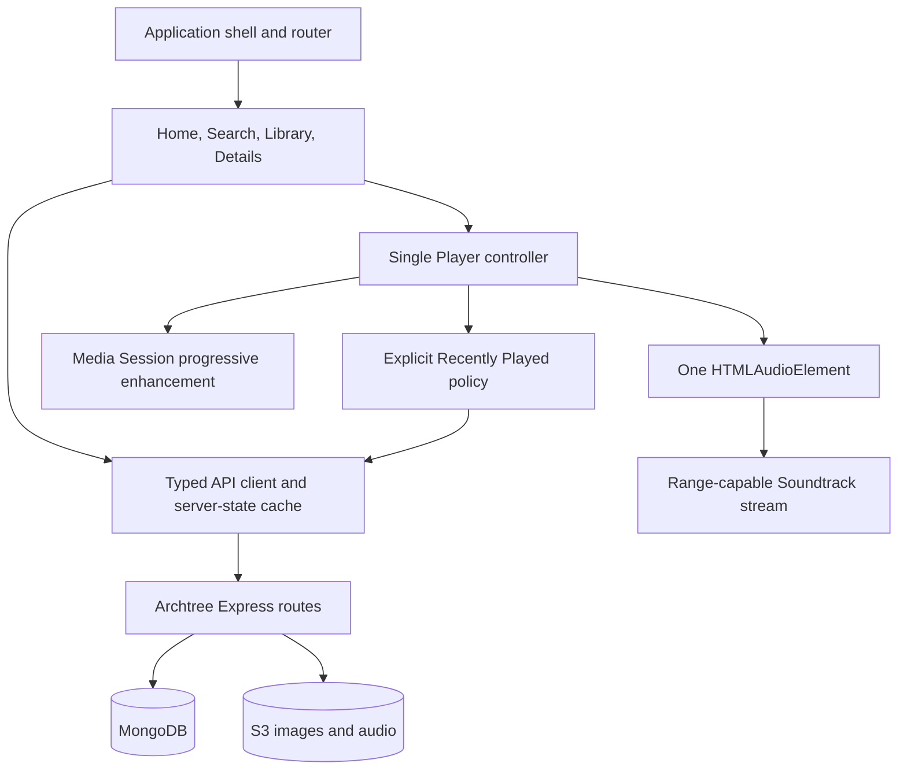

# Finitude Web Listener Plan

## Status

In progress as of 2026-08-02. The first four implementation slices now provide
the `/listen` workspace and responsive shell, browser-only HttpOnly cookie
sessions, safe versioned listener DTOs for Home, Search, Album, Artist, Track,
and Library, ready-only public streaming, real configured discovery content,
grouped search, detail pages, one persistent browser player, Save/Library UI,
per-account search history, registration/verification/recovery, signed-in
device and password management, an expanded mobile player, accessible keyboard
controls, private revision-bound avatar loading and crop/preview management,
listening-history clearing, sign out everywhere, account deletion, strict
listener CSP/security headers, route-level code splitting, a 150 KiB initial
route JavaScript budget, Express deep-link integration, and server/Web tests.
Browser E2E/accessibility automation, observability, load/cross-browser checks,
and rollout work remain in later slices.

This document is implementation guidance, not the canonical product contract.
Before implementing a Web-specific behavior, promote the agreed rule to
`../business-rules.md` in the same change as the implementation.

This plan intentionally treats Finitude as the source for product behavior and
content semantics, while using Spotify Web and YouTube Music only as references
for desktop information density, persistent navigation, and player placement.
It must not copy either product's branding, exact components, assets, or visual
details.

## Objective

Add a listener-facing Web application to Archtree that supports public music
discovery, authenticated Library behavior, and persistent audio playback. The
Web experience should feel like the same product as Finitude iOS without
recreating the SwiftUI interface.

The first production release should let a listener:

- Browse a creator-configured Home page while signed out or signed in.
- Search Artists, Albums, and Soundtracks.
- Open Artist and Album details through stable, shareable URLs.
- Start an album queue or play a selected Soundtrack.
- Continue listening while navigating within the Web application.
- Log in, save or unsave supported content, and browse the complete server
  Library with its existing filters, sorting, and cursor pagination.
- Use the application with keyboard navigation, a screen reader, reduced
  motion, browser zoom, and desktop or mobile layouts.

Offline downloads, editable queues, playlists, lyrics, voice search, and
cross-device playback handoff were not part of the first release. User
Playlists are now planned independently in
`finitude-user-playlists-plan.md`; that new roadmap does not change this
document's historical MVP boundary.

## Product and technical principles

1. **Shared behavior, platform-native presentation.** Album playback,
   Soundtrack playback, saving, recent activity, artwork fallback, and
   personalized content follow the canonical rules. Navigation placement,
   hover behavior, responsive breakpoints, volume controls, and keyboard
   shortcuts may be Web-specific.
2. **One player and one queue.** The application owns one long-lived audio
   element and one queue state. Pages launch or inspect that state; they do not
   create their own players.
3. **Same-origin browser application.** Production assets and APIs are served
   by the same Archtree origin. This allows HttpOnly browser cookies and avoids
   a credentialed cross-origin architecture. Development uses a frontend proxy
   to the local Express process.
4. **Stable URLs around a persistent shell.** Home, Search, Library, Artist,
   Album, and account routes are deep-linkable. Client-side route changes do
   not tear down playback.
5. **Server state is not player state.** API data uses a query/cache layer;
   the queue, current item, time, volume, and playback status use a separate
   player controller. Search history is browser-local and account-scoped.
6. **Progressive enhancement for browser media integration.** Core playback
   uses `HTMLAudioElement`. Media Session metadata and system control handlers
   are enabled only when supported; their absence must not break playback.
7. **Streaming-only Web.** The Web listener intentionally provides no Finitude
   Download action, Download filter, offline state, or browser-local media
   lifecycle. A normal browser file download is not labeled as Finitude
   offline content.
8. **Canonical rules win over client gaps.** The Web client supports the
   documented Carousel, Grid, and List page-item contract even though the
   current iOS Home implementation renders only Carousel items.

## Current-state assessment

### Reusable Archtree capabilities

The repository already provides most foundational data and media operations:

- Public expanded Home composition at
  `GET /content/pages/home/expanded`, with optional viewer authentication.
- Public Artist, Album, Soundtrack-list, image, and grouped search reads.
- Public Soundtrack `HEAD` and `GET` streaming with byte-range support.
- Authenticated Save, Unsave, bulk Save status, complete Library pagination,
  and explicit Recently Played recording.
- Password, email verification/recovery, optional provider authentication,
  passkeys, profile identity, avatar, active sessions, and account management.
- Browser access and refresh cookies for the existing server-rendered login
  flow.
- Creator-configured Carousel, Grid, and List page-item models.

### Gaps to close before the Web UI depends on them

1. The existing JSON `POST /auth/refresh` expects the refresh token in the
   request body. A listener SPA must never read the HttpOnly refresh cookie, so
   it needs a cookie-backed JSON refresh operation and a single-retry client
   policy.
2. Existing protected JSON routes accept the browser access cookie but do not
   automatically rotate an expired access cookie. Without the browser refresh
   operation, a valid browser session becomes a false sign-out after access
   token expiry.
3. The existing server-rendered login endpoint sets secure cookies but returns
   HTML or redirects. The SPA needs JSON-compatible browser login/logout
   endpoints that set or clear the same cookies without exposing tokens to
   JavaScript.
4. `GET /content/audioTrack/:id` redirects to the audio stream and therefore
   is not a Soundtrack metadata endpoint.
5. Album and Artist detail reads require client-side fan-out. The iOS client
   currently fetches all Soundtracks or loops through Album IDs; that is too
   expensive and incomplete for a desktop Web route.
6. Home expansion does not yet include every related Artist or Post needed to
   render all configured items without additional broad collection reads.
7. Search results need the same normalized Soundtrack text, inherited Album
   artwork, and creator attribution used by Home and Library.
8. Browser cookie mutations need an explicit same-origin/CSRF policy. The
   existing wildcard CORS header must not be extended into credentialed
   cross-origin access.
9. The legacy `POST /auth/signup-web` path creates an already-verified account,
   which conflicts with the canonical single-use email-verification rule. The
   listener must use the verification-aware registration flow, and the legacy
   path must be repaired or retired before it is linked from the new product.
10. The existing login `returnTo` value is redirected without restricting it
    to an allowed same-origin listener path. Browser authentication work must
    close this open-redirect risk before reusing the flow.
11. The public stream reads S3 by the requested ID without first applying the
    database `uploadStatus === "ready"` lifecycle check used by authenticated
    downloads. A stale/orphan object must not remain publicly playable merely
    because its key can be guessed.
12. Public catalog and search routes expose database-shaped documents and do
    not consistently filter non-ready Soundtracks or remove internal lifecycle
    fields such as storage keys and upload errors. A shared listener DTO
    resolver is required.
13. Album membership/order, Album artist attribution, and unavailable-track
    behavior are not yet one explicit read contract. The current
    `Album.audioTrackIds`, `AudioTrack.albumId`, `Artist.albumIds`, and
    `AudioTrack.artistIds` relationships can disagree and must not be reconciled
    differently by each client.
14. Manual Grid/List definitions can be large, but the resolved listener read
    path does not yet provide true cursor pagination for those collections.
15. The current build and deployment scripts do not build or serve a bundled
    listener application.

## Scope

### Web MVP

- Responsive application shell.
- Home with Carousel, Grid, and List.
- Search with local recent-search history.
- Artist details.
- Album details and ordered Soundtrack list.
- One persistent player and album queue.
- Password login, session recovery, logout, and capability-driven account
  entry points.
- Save and Unsave.
- Complete server-backed Library with Albums/Songs filters and the three
  canonical sort modes.
- Personalized Home sections.
- Essential account identity display and a route into account management.
- Accessibility, performance, security, observability, and production rollout.

### Explicitly excluded from Web

- Browser offline downloads, Download filtering, and device-local media
  management. These remain native-client capabilities.

### Deferred from the MVP

- Editable Up Next, Play Next, Add to Queue, or live queue drag-to-reorder.
- User Playlists, now tracked by `finitude-user-playlists-plan.md` as a
  post-MVP, shared Web/iOS feature.
- Lyrics, comments, social features, and voice search.
- Video playback unless a separate product contract defines its relationship
  to Albums and Soundtracks.
- Spotify Connect-style device discovery or cross-device queue handoff.
- Guaranteed lock-screen or background behavior beyond what the active
  browser and operating system permit.
- iOS-only gestures, Liquid Glass controls, and the system audio-route picker.

## Proposed information architecture

The recommended production base path is `/listen`. It keeps the listener app
separate from the current `/` workspace landing page and `/content/manage`
creator tools during development and rollout.

| Route | Purpose | Signed-out behavior | Primary action |
| --- | --- | --- | --- |
| `/listen` | Configured Home | Public content; personalized groups are empty | Open Album or play Soundtrack |
| `/listen/search?q=` | Search and recent queries | Fully public | Open Artist/Album or play Soundtrack |
| `/listen/library` | Complete server Library | Authentication-required state; not an empty success | Filter, sort, open, or play saved content |
| `/listen/albums/:albumId` | Album details and ordered track list | Public | Album Play or explicit track playback |
| `/listen/artists/:artistId` | Artist profile and releases | Public | Open a release |
| `/listen/account` | Identity and account management | Login/create-account entry | Manage current account |
| `/listen/login` | Browser login | Public | Establish HttpOnly browser session |
| `/listen/signup` | Email registration and verification | Public | Create and verify account |
| `/listen/recover` | Password recovery | Public | Request and complete password reset |

Settings should live in the desktop account menu rather than occupy a fourth
primary navigation item. Mobile Web may expose Account as an avatar button or
sheet while preserving Home, Search, and Library as the three primary tabs.

## Layout and visual direction

### Desktop, 1024 px and wider

- A persistent left navigation rail contains the Finitude identity and the
  primary Home, Search, and Library destinations. Account access remains in
  the top bar; a Spotify-style secondary saved-item sidebar is not assumed
  until its behavior is separately defined.
- A sticky top bar contains browser-like back/forward controls, contextual
  search, and the account entry.
- The main content pane is the only primary vertical scrolling region.
- A fixed bottom player spans the application and reserves its own layout
  height so it never covers the final content row.
- Album and Artist details use a broad hero header followed by dense, readable
  track or release content.

### Tablet, 768–1023 px

- Collapse the navigation rail to icons with accessible names and tooltips.
- Keep the bottom player, but reduce secondary metadata and nonessential
  controls before compressing primary playback controls.
- Allow card grids to reduce columns without changing a configured Grid into a
  List or Carousel.

### Mobile, below 768 px

- Use bottom navigation for Home, Search, and Library.
- Place a compact Now Playing bar immediately above navigation.
- Open the full player as an app-owned modal surface or sheet while retaining
  the same underlying player and queue.
- Use tap controls in the first release; iOS mini-player swipe gestures are not
  required for Web parity.

### Original Finitude visual language

- Start with neutral dark surfaces suitable for artwork-heavy browsing, with
  restrained blue, purple, mint, and warm gradient accents derived from
  Finitude's ambient background rather than Spotify green or YouTube red.
- Define typography, spacing, radii, elevation, focus rings, motion, and
  artwork ratios as design tokens.
- Use artwork-derived color only as a bounded enhancement in detail headers;
  preserve contrast and supply a deterministic fallback.
- Provide `prefers-reduced-motion` and high-contrast-safe treatments from the
  first component slice.

## Recommended architecture

### Repository integration

- Add `web/` as an npm workspace while retaining one root `package-lock.json`.
- Use React, TypeScript, and Vite for the listener SPA. This is a stateful
  application rather than a collection of isolated server-rendered pages, and
  a persistent React root keeps the player mounted across route changes.
- Use React Router's Data Router mode for deep links, nested shell routes,
  browser history, and route error boundaries.
- Use TanStack Query for API server state, retries, invalidation, and cursor
  pagination, and Zod at the network boundary for runtime response validation.
- Keep player state in a dedicated external controller/store with selector
  subscriptions and explicit commands rather than placing rapidly changing
  playback time in a broad React Context that re-renders the application tree.
- Use CSS Modules plus global design tokens instead of adopting another
  product's component library or visual system.
- Use Vitest and React Testing Library for unit/component behavior, MSW for
  deterministic API boundaries, Playwright for Chromium/WebKit/Firefox E2E,
  and `@axe-core/playwright` for automated accessibility checks supplemented by
  manual assessment.
- Build hashed assets into `web/dist/`. Express serves those assets under
  `/listen/` and returns the SPA document for recognized listener routes.
- In development, Vite proxies `/auth`, `/content`, `/feed`, and `/video` to
  Express so cookies remain same-site from the browser's point of view.
- Keep backend TypeScript and Web TypeScript configurations separate so JSX,
  DOM types, and bundler settings do not leak into the server build.

Recommended source boundary:

```text
web/
├── src/
│   ├── app/          # router, providers, shell, route errors
│   ├── api/          # fetch client, Zod schemas, query keys, DTO adapters
│   ├── features/     # home, search, library, catalog, account
│   ├── player/       # audio engine, store, queue and activity policies
│   ├── components/   # accessible reusable UI primitives
│   ├── styles/       # tokens, reset, responsive foundations
│   └── test/         # fixtures, MSW handlers, shared test utilities
├── e2e/              # Playwright user journeys
├── package.json
├── tsconfig.json
└── vite.config.ts
```

Vite documents this traditional-backend integration model, including a
development server and a production manifest/build output:
<https://vite.dev/guide/backend-integration.html>.

The selected routing, cache, and schema tools are documented at:
<https://reactrouter.com/routers/home>,
<https://tanstack.com/query/latest/docs/framework/react/installation>, and
<https://zod.dev/>. Exact versions should be chosen and locked during Phase 1
after confirming compatibility with this repository's Node and TypeScript
versions; the plan does not depend on an unpinned `latest` at runtime.
Playwright's accessibility guidance explicitly recommends combining automated
checks with manual assessment:
<https://playwright.dev/docs/accessibility-testing>.

### Runtime ownership



The player controller owns:

- Queue items, current index, and queue origin.
- Current metadata, duration, elapsed time, buffered ranges, and error state.
- Play, pause, seek, ten-second skips, previous, next, mute, and volume.
- Automatic advancement and queue-boundary behavior.
- Media Session metadata and supported action handlers.
- The distinction between a new explicit launch and navigation within an
  existing queue.

Pages may dispatch a launch intent but must not call the Recently Played API
directly. One policy function maps the launch intent to either an Album event,
a Soundtrack event, or no event. This policy should be ported from the tested
iOS `PlaybackActivityPolicy` semantics.

### Browser session design

1. Login submits credentials to a browser-specific JSON endpoint.
2. Archtree sets short-lived access and rotating refresh tokens only as
   `HttpOnly`, `Secure` in production, and appropriate `SameSite` cookies.
3. The Web API client sends same-origin requests and never reads or stores
   either token.
4. On the first authenticated `401`, the client coalesces concurrent refresh
   attempts into one cookie-backed refresh request, then retries the original
   request once.
5. A failed refresh clears session UI and returns the user to the originating
   context without an infinite retry loop.
6. Logout revokes the refresh session, clears both cookies, clears account-
   scoped caches and search history, and does not stop an already-playing
   public stream unless a separate rule later requires that behavior.
7. State-changing cookie requests enforce an allowed `Origin` and/or CSRF
   token policy. No refresh token is placed in `localStorage`,
   `sessionStorage`, a URL, logs, or client telemetry.

## Backend contract work

Recommended endpoint names are additive and can be finalized in Phase 0. A
versioned read-only listener namespace such as `/api/listener/v1` is preferred
over exposing raw Content Manager documents or silently changing existing
mobile response shapes. Existing Save/Library/activity mutations can remain in
their current namespace while both clients migrate toward shared public DTOs.

| Contract | Proposed work | Reason |
| --- | --- | --- |
| Browser session login | Add JSON browser login that sets cookies but returns only safe profile/session metadata | Existing Web login returns HTML/redirects |
| Browser session refresh | Add cookie-backed refresh that rotates and resets both cookies | JavaScript cannot and should not read the refresh cookie |
| Browser session logout | Add JSON logout that revokes and clears cookies | SPA should not depend on document form redirects |
| Current identity | Reuse `GET /auth/me` after the client refresh policy; preserve private avatar semantics | One authoritative account source |
| Expanded Album | Add `GET /api/listener/v1/albums/:id` with Album, ordered Soundtracks, Artists, derived artwork, availability, and explicit missing references | Avoid broad `/audioTracks` reads and client N+1 work |
| Expanded Artist | Add `GET /api/listener/v1/artists/:id` with Artist and cursor-paginated releases | Avoid one request per Album ID |
| Soundtrack metadata | Add `GET /api/listener/v1/tracks/:id` returning metadata rather than redirecting to bytes | Current singular route is a stream redirect |
| Expanded Home | Add `GET /api/listener/v1/home` containing every referenced Album, Soundtrack, Artist, and Post required by resolved page items | Render one configured page without broad catalog downloads |
| Search | Add `GET /api/listener/v1/search` with normalized text, derived artwork, creator attribution, readiness filtering, stable sort, and pagination | Search cards and playback require resolved metadata |
| Collection page | Add a bounded cursor read for large resolved Grid/List definitions | Avoid embedding or fetching hundreds of records at once |
| Library | Reuse `GET /content/me/library`; preserve cursor and deterministic sort contract | Already implements complete Saved Library semantics |
| Save/activity | Reuse current mutation endpoints; verify browser-cookie CSRF and refresh behavior | Preserve shared iOS data and rules |
| Audio stream | Make `HEAD` and `GET` share a public-ready asset resolver that validates the database record, lifecycle state, and stored key before reusing the current Range delivery service | Seeking must work, but orphan/non-ready objects must not be public |

Every listener response should have a bounded limit, deterministic ordering,
explicit missing-reference representation where product UI needs a warning,
and tests that prevent leaking creator-only, storage-lifecycle, or private
account data. The shared resolver must allow only published/displayable
records and `ready` Soundtracks, and must remove fields such as `createdBy`,
`s3Key`, and `uploadError` unless a separate public contract explicitly needs
them.

## Implementation phases

### Phase 0 — Contract, scope, and design baseline

**Estimate:** 3–5 developer days.

Tasks:

- Confirm `/listen` as the initial base path and decide whether `/` remains the
  workspace landing page after general release.
- Confirm that Web remains streaming-only and all Download and offline UI are
  absent.
- Confirm Web-specific playback expectations: playback persists across SPA
  routes and while the browser permits background audio, but the product does
  not promise iOS-equivalent locked/background execution.
- Decide the canonical Album-track relationship and ordering source. The
  recommended rule is to preserve `Album.audioTrackIds` order, report a
  reference that points to a missing/non-ready track as unavailable, and use
  `AudioTrack.albumId` as a reconciliation check rather than silently appending
  every reverse-linked track.
- Decide how Album artist attribution is resolved when `Artist.albumIds` and
  component `AudioTrack.artistIds` disagree, and whether the UI shows or hides
  non-ready tracks. Record the answer as product behavior rather than leaving
  it to endpoint-specific inference.
- Confirm whether all newly created Artist/Album records are immediately
  public or whether the product needs a draft/published lifecycle before the
  listener API launches.
- Prepare the exact `docs/business-rules.md` additions for the Web Library's
  server-only Saved view with no offline support, browser-local search history,
  persistent player behavior, and progressive Media Session support. Apply each
  agreed addition in the same change as the implementation it governs.
- Freeze the route map and additive response contracts listed above.
- Produce desktop, tablet, and mobile wireframes for the shell, Home, Album,
  Search, Library, and player states.
- Define design tokens and component state matrices: default, hover, focus,
  active, disabled, loading, empty, warning, and error.
- Convert canonical Save and Recently Played rules into platform-independent
  acceptance scenarios before UI implementation.
- Define the supported browser matrix. Recommended initial baseline: current
  and previous major Chrome, Edge, Firefox, and Safari, plus current iOS Safari
  and Android Chrome.

Exit criteria:

- No proposed behavior conflicts with `business-rules.md`.
- Every MVP screen has a route, data contract, signed-out state, loading state,
  empty state, and error state.
- Album Play, selected-track play, standalone-track play, Previous/Next, and
  automatic advancement each have an unambiguous activity expectation.
- Product review accepts the visual direction as Finitude rather than a copied
  Spotify or YouTube Music skin.

### Phase 1 — Web build, routing, API, and session foundation

**Estimate:** 5–8 developer days.

Tasks:

- Scaffold the React/TypeScript/Vite application in `web/`.
- Refactor Express construction into an importable application factory and a
  separate database/listen bootstrap so route integration tests do not open a
  real production listener merely by importing `src/app.ts`.
- Add root scripts for Web development, Web tests, Web build, full build, and
  full test execution.
- Add Express production asset serving and SPA fallback routing under
  `/listen`, without intercepting `/auth`, `/content`, `/feed`, admin, or
  content-manager routes.
- Add Vite development proxying and document the two-process local workflow.
- Implement route definitions, an application error boundary, not-found state,
  and deep-link refresh handling.
- Implement the typed API client, shared response adapters, error taxonomy,
  request cancellation, and one-attempt refresh coordinator.
- Add the browser JSON login, refresh, and logout contracts with cookie and
  CSRF/origin protections.
- Use verification-aware `POST /auth/signup` plus email verification for new
  listener accounts; repair or stop linking the legacy auto-verified Web signup
  path.
- Validate every authentication return path against an allowed relative
  `/listen` destination before redirecting or returning it.
- Report Web provider capabilities separately enough that an iOS Apple/Google
  client configuration cannot accidentally expose a nonfunctional browser
  provider button.
- Add a session bootstrap that distinguishes signed out, checking, signed in,
  refresh failed, and temporarily unavailable states.
- Establish frontend unit/component tests and Playwright E2E infrastructure
  with deterministic seeded catalog data.
- Update CodeBuild packaging so the listener bundle is tested and retained in
  the deployment artifact.

Exit criteria:

- `/listen`, nested routes, direct refreshes, and browser back/forward work in
  development and a production build.
- A listener can log in, survive access-token expiry through one cookie-backed
  rotation, and log out without any token being readable by JavaScript.
- A failed refresh results in one controlled sign-out, not repeated 401 loops.
- Existing backend tests and Content Manager routes remain green.

### Phase 2 — Responsive shell and design system

**Estimate:** 5–7 developer days.

Tasks:

- Build the desktop navigation rail, sticky top bar, account entry, main
  scroll container, and fixed bottom-player slot.
- Build the collapsed tablet rail and mobile bottom navigation/mini-player
  composition.
- Implement primitives for Button, IconButton, Artwork, Avatar, Tooltip,
  Skeleton, InlineError, EmptyState, Dialog, Menu, FilterChip, Card, ListRow,
  Carousel, and Grid.
- Provide strong visible focus, skip-to-content, semantic landmarks, route
  announcements, and touch targets suitable for mobile Web.
- Implement responsive card sizing through CSS grid/container behavior without
  changing configured presentation type.
- Implement neutral and artwork-fallback surfaces plus reduced-motion rules.
- Reserve player/navigation clearance in every scrolling view.
- Create representative visual fixtures for long titles, absent metadata,
  failed artwork, no avatar, mixed Album/Soundtrack content, and narrow widths.

Exit criteria:

- The shell works at 320 px, 768 px, 1024 px, and wide desktop reference
  widths without hidden content or overlapping controls.
- All navigation and shell controls are usable by keyboard and have meaningful
  accessible names.
- Browser zoom to 200% remains operable without two-dimensional page scrolling.
- Visual review approves the independent Finitude design language.

### Phase 3 — Public Home, Artist, and Album discovery

**Estimate:** 7–10 developer days.

Backend tasks:

- Implement and test expanded Album, expanded Artist, Soundtrack metadata, and
  complete Home inclusion contracts.
- Centralize listener DTO projection so pending/failed/deleting Soundtracks
  and storage lifecycle fields cannot leak through Home, Search, details, or
  broad catalog fallbacks.
- Preserve configured page-item order and deterministic child order.
- Apply Soundtrack title normalization and artwork fallback in every response.
- Resolve creators in batches and eliminate per-card or per-track API calls.

Frontend tasks:

- Render Home Carousel, Grid, and List definitions according to their persisted
  presentation types.
- Render mixed personalized Album/Soundtrack carousels when signed in; omit
  personalized items when signed out.
- Implement Artist details with biography/artwork fallbacks and releases.
- Implement Album details with hero metadata, prominent Album Play placement,
  ordered tracks, duration, unavailable-track state, and Save placeholders.
- Make Album and Artist cards navigate; make Soundtrack rows dispatch a player
  launch intent once Phase 4 is available.
- Preserve useful content on refresh failures and distinguish initial loading,
  empty configuration, partial missing references, and total failure.
- Lazy-load offscreen artwork while preventing layout shift.

Exit criteria:

- A signed-out listener can browse from Home to Artist and Album through stable
  URLs.
- Home renders all three canonical page-item types in configured order.
- Album and Artist pages do not download the entire catalog or issue one
  request per child item.
- Missing artwork and metadata use the canonical fallback behavior and remain
  accessible.
- A creator configuration warning does not crash or silently reorder the page.

### Phase 4 — Persistent player and playback policy

**Estimate:** 8–12 developer days.

Tasks:

- Implement the app-root player controller and exactly one audio element.
- Make public stream `HEAD` and `GET` use the same database-backed ready-asset
  resolver and stored `s3Key`; reject invalid IDs, missing records,
  non-ready/deleting records, and orphan-only S3 objects consistently.
- Model queue source, queue origin, current index, playback state, buffering,
  duration, current time, volume, mute, and recoverable/fatal errors.
- Implement Album Play as an ordered album queue beginning at the first
  playable item and recording only the Album.
- Implement an explicitly selected Album track as the same album queue starting
  at that track while recording only that Soundtrack.
- Implement a Soundtrack outside an album queue as a one-item queue recording
  that Soundtrack.
- Ensure Previous, Next, Media Session controls, and automatic advancement do
  not add new activity entries.
- Add desktop player controls, mobile mini-player, expanded mobile player,
  progress seeking, ten-second skips, volume, mute, and disabled queue-boundary
  states.
- Keep the originating page visible when playback begins and keep playback
  alive across all SPA routes.
- Integrate Media Session metadata and action handlers behind feature checks.
  MDN marks parts of Media Session as having incomplete cross-browser
  availability, so this remains progressive enhancement:
  <https://developer.mozilla.org/en-US/docs/Web/API/Media_Session_API>.
- Handle browser autoplay rejection, stream `404`/`409`/`416`/`5xx`, network
  interruption, stale metadata, queue exhaustion, and source replacement.
- Add keyboard shortcuts only when focus is not in an editable control, and
  document them in an accessible help surface.
- Report playback success/failure and media-delivery diagnostics without
  logging tokens, private account data, or raw sensitive URLs.

Exit criteria:

- Playback, time, and queue position survive route changes without a second
  player or restart.
- Range seeking works against production-equivalent media delivery.
- Every launch/navigation path passes activity-policy tests, including queue
  boundaries and automatic advancement.
- Unsupported Media Session actions fail harmlessly while visible controls
  continue to work.
- The final page row remains reachable above the player at every breakpoint.

**Milestone A: public listening alpha.** At this point the product is a
demonstrable signed-out Web music experience, even though Search, Save, and
Library are not yet complete.

### Phase 5 — Search

**Estimate:** 4–6 developer days.

Tasks:

- Enhance the grouped Search response with normalized titles, derived artwork,
  and resolved creator metadata.
- Implement top-bar and route-level search with a 300 ms cancellable debounce,
  explicit submit, URL query synchronization, and stale-response protection.
  Draft edits request the latest results but do not record intermediate queries.
- Show grouped Artist, Album, and Soundtrack results. Do not show a Recent
  Content group after a query is submitted.
- Open Artist and Album results and launch Soundtrack playback through the
  shared player policy.
- Store at most ten recent queries locally per account identity, moving a
  repeated query to newest without duplication.
- Keep signed-out history isolated from authenticated identities. Clear an
  authenticated account's local history on that account's logout.
- Implement initial, typing, loading, no-result, error, retry, and result
  states. Do not claim an offline fallback because Web has no local-download
  content source.

Exit criteria:

- Search works signed out and signed in, is deep-linkable, and never displays a
  late response for an older query.
- History limits, deduplication, identity isolation, and logout deletion have
  unit and E2E coverage.
- Every result type performs the canonical action.

### Phase 6 — Save, Library, and listener account flows

**Estimate:** 7–10 developer days.

Tasks:

- Implement capability-driven account entry. Password remains the fallback;
  Apple, Google, and passkey controls appear only when the deployment reports
  them as fully configured.
- Complete email login, registration verification, resend, forgot-password,
  and reset-password browser routes.
- Add Save controls to Album and Soundtrack contexts. Signed-out controls
  remain visible with disabled styling and show a sign-in-required message
  without automatically opening login.
- Batch Save-status reads for visible content and invalidate the relevant Home,
  details, and Library queries after confirmed mutations.
- Show an explicit pending state during Save/Unsave and update authoritative
  saved state only after server confirmation. A rejected request preserves the
  prior state and announces the error.
- Build the Web Library as one mixed, vertical Album/Soundtrack list backed by
  `GET /content/me/library` rather than configured Library page items.
- Implement additive Albums and Songs filters, Recent Activity/Recently
  Saved/Recently Played sorting, cursor pagination, deterministic ordering,
  empty states, and duplicate protection.
- Treat a Library `401` as session recovery or authentication required, never
  as an empty successful Library.
- Include a stable account route with authoritative avatar/initials fallback,
  logout, and links to active sessions and credential management.
- If full avatar/account management cannot fit the MVP schedule, retain the
  current server-rendered or minimal account flow behind the stable route and
  schedule the complete crop/revision/session UI immediately after MVP.

Exit criteria:

- Web and iOS show the same Saved relationships and bounded recent histories
  for one test account.
- Saving the 21st recent item does not limit the complete Saved Library.
- Unsave removes the item from Recently Saved immediately after server
  confirmation without deleting any unrelated content.
- Library filters, sorts, cursor resets, and next-page behavior pass automated
  tests.
- Account changes never leak an old user's avatar, cache, search history, or
  personalized content into the new session.

**Milestone B: feature-complete Web MVP / private beta.** Home, Search,
playback, authenticated Save, and Library now form a complete listener loop.

### Phase 7 — Hardening, accessibility, performance, and rollout

**Estimate:** 6–9 developer days.

Tasks:

- Run full backend unit/integration tests, frontend unit/component tests, and
  Playwright E2E tests in CI.
- Add automated accessibility checks and manual keyboard/screen-reader checks
  for core flows. Resolve all critical and serious findings before release.
- Test current/previous Chrome, Edge, Firefox, and Safari plus target mobile
  browsers, explicitly documenting Media Session differences.
- Add Content Security Policy, referrer policy, MIME protections, asset cache
  headers, same-origin form protections, and production cookie checks.
- Verify no private avatar, refresh token, access token, credential, or raw
  sensitive account data enters client logs or telemetry.
- Add Web Vitals and route/API/playback error observability with bounded event
  fields. Authentication funnel telemetry must retain its existing privacy
  limits.
- Optimize route-level code splitting, artwork sizing, lazy loading, cache
  policy, list rendering, and Home payload size.
- Target p75 LCP at or below 2.5 seconds, CLS below 0.1, and INP below 200 ms on
  agreed production traffic profiles. Establish a measured initial JavaScript
  budget during Phase 1 and fail CI on material unreviewed growth.
- Load-test concurrent range streams and verify media concurrency limits and
  health metrics under realistic seek/skip behavior.
- Verify artwork requests cannot exhaust the same capacity needed by active
  audio streams; split image/audio limits or reserve playback capacity if the
  measured shared pool allows artwork-heavy Home pages to starve playback.
- Serve `/listen` behind an environment flag or unlinked route for internal
  validation, then link it from the landing page after beta acceptance.
- Keep `/content/manage` and the current landing/auth routes unchanged during
  rollout. Retain the previous deployment artifact for immediate rollback.

Exit criteria:

- No open release-blocking accessibility, security, data-integrity, playback,
  or authentication defect.
- The production artifact includes hashed Web assets and direct route refresh
  support.
- Core E2E scenarios pass against a production-equivalent deployment and media
  store.
- Monitoring distinguishes page/API failures from audio delivery failures.
- Rollout and rollback have both been rehearsed.

Implementation evidence updated on 2026-08-03:

- Complete in the repository: strict anonymous Web Vitals and error telemetry,
  private-avatar public-route denial, playback-reserved media admission and
  per-resource health metrics, production-bundle Playwright coverage across
  Chromium/Firefox/WebKit, axe critical/serious gates, responsive and Reduce
  Motion checks, fixed-bottom player scroll regression coverage, CI automation,
  and a remote-opt-in bounded Range/seek/artwork load harness with aggregate-only
  output. Responsive artwork now uses seven
  fixed versioned WebP sizes, attached-owner public validation, ETag
  revalidation, and a separate CPU concurrency limit without creating
  derivative S3 objects. CI also validates a strict runtime allowlist, records its source
  identity, and retains a commit-named rollback bundle; the rollout runbook
  requires the same tested bytes for staging and production.
- Passing locally: server 112/112, Web unit/component 103/103, Mongo integration
  24/24, browser/axe 39/39, server/Web production builds, and the 150 KiB
  initial-route JavaScript budget (largest route 140.9 KiB gzip). The validated
  Elastic Beanstalk staging artifact also contains the hashed listener assets
  and deep-link runtime contract.
- Still requires production-equivalent evidence: branded-browser and assistive
  technology matrix, measured p75 Web Vitals, realistic multi-source S3 Range
  load/seek/artwork execution with the checked-in harness, and an actual
  rollout/rollback rehearsal using the retained artifacts. A checked-in runbook
  and locally validated bundle are the contract, not the rehearsal evidence.
- Beta acceptance and navigation update recorded on 2026-08-03 by user
  direction: the existing Archtree landing page now links signed-out and
  signed-in visitors to `/listen` without replacing its creator, account, or
  authentication actions.

**Milestone C: general availability.** Only after this gate should product
navigation make the listener Web app the primary public destination.

### Phase 8 — Post-MVP account completeness

This phase is intentionally not scheduled into the first release.

Avatar crop/preview/revision behavior, active-session revocation, change
password, sign out everywhere, clear listening history, and account deletion
are now implemented on Web. Remaining account-completeness work may include
provider linking/unlinking and passkey enrollment. Each future flow must
preserve the existing partial-failure and private-avatar rules.

Browser offline playback and downloads are not part of Phase 8 or the Web
roadmap. The Web listener remains streaming-only; the native-client download
lifecycle remains governed separately by the canonical Offline Downloads
rules.

## Test strategy

### Backend tests

- Cookie-backed login, refresh rotation, concurrent refresh rejection, logout,
  expiry, verification-required registration, safe return paths, secure
  transport, Origin/CSRF checks, and response privacy.
- Expanded Home/Album/Artist/Soundtrack schemas, ordering, limits, deleted or
  dangling references, text normalization, readiness filtering, internal-field
  removal, and artwork fallback.
- Search grouping and resolved metadata.
- Library cursor, filters, sorting, 20-item activity limits, full Saved
  retention, and deleted-content cleanup.
- Stream `HEAD`, full `GET`, open-ended/suffix ranges, invalid ranges, aborts,
  missing/not-ready content, and response headers.

### Frontend unit and component tests

- Playback launch policy and queue reducer transitions.
- Previous/Next boundaries, auto-advance, seeking, error recovery, and player
  lifecycle.
- API refresh coalescing, one retry, cancellation, and cache clearing.
- Page-item discriminators and ordered rendering.
- Search debounce/submission/history/navigation/isolation.
- Library filters, sorts, cursor reset, deduplication, and Save-state updates.
- Artwork/avatar fallback, long/missing text, error/empty/loading states, focus
  management, and reduced motion.

### End-to-end release scenarios

1. Signed-out Home → Album → Album Play; the content route remains visible and
   the bottom player appears.
2. Album Play records only the Album; selected track records only the
   Soundtrack; Next/Previous/automatic advancement record nothing extra.
3. Playback continues through Home, Search, Library authentication state, and
   browser back/forward navigation.
4. Signed-out Save remains visible, shows the required message, and does not
   automatically open login or mutate data.
5. Login returns to the originating route, access-token expiry refreshes once,
   and refresh failure becomes a controlled sign-out.
6. Save an Album and Soundtrack, find both in the mixed Library, combine type
   filters, switch every sort, paginate, then Unsave.
7. Search returns grouped results, cancels stale requests, starts playback from
   Soundtrack results, caps history at ten, and clears account history on
   logout.
8. Missing artwork, missing optional metadata, a dangling configured reference,
   a partial Home refresh failure, and a stream failure all produce truthful
   recoverable UI.
9. Keyboard-only and screen-reader users can reach navigation, cards, rows,
   dialogs, filters, and all player controls without hover or gesture-only
   dependencies.
10. A 320 px viewport, tablet, wide desktop, 200% zoom, and reduced motion all
    retain complete operability.

## Delivery dependencies and parallel work

The critical path is:

`contract decisions → browser session/API foundation → catalog contracts →
player policy → Save/Library → release hardening`.

After Phase 0, work can be parallelized safely:

- Design system and responsive shell can proceed while expanded catalog
  endpoints are implemented.
- Playback policy/reducer tests can proceed against fixtures while player UI
  and media-delivery tests are developed.
- Search can proceed after the API client and shell are stable, in parallel
  with late player polish.
- Accessibility and E2E coverage begin with the first components and are not a
  final-week-only activity.

Indicative total effort for one engineer is 45–67 developer days, or roughly
9–13 calendar weeks after decisions and test data are available. Two engineers
with clear frontend/backend ownership may reach private beta in approximately
6–9 weeks, but authentication, player policy, and release verification remain
shared integration gates rather than fully parallel tasks.

## Primary risks and mitigations

| Risk | Consequence | Mitigation |
| --- | --- | --- |
| Access cookie expires while refresh cookie is valid | False logout or repeated failed requests | Cookie-backed refresh, coalesced single retry, integration tests |
| Page/details require broad or N+1 reads | Slow Home and details, excess database load | Bounded expanded endpoints and batch resolution |
| Multiple pages instantiate audio | Playback restarts and histories duplicate | One app-root player and policy-owned activity writes |
| Browser autoplay/background differences | Playback appears inconsistent by browser | User-gesture launch, progressive Media Session, explicit browser matrix |
| Wildcard CORS combined with browser credentials | Security exposure or broken cookies | Same-origin production, dev proxy, no wildcard credential mode, Origin/CSRF checks |
| Legacy signup/return path is reused unchanged | Verification rules are bypassed or login enables open redirects | Verification-aware registration and allowlisted relative return paths |
| Public stream bypasses DB lifecycle | Deleted, failed, or orphan-only media stays playable | Shared DB-backed ready resolver for stream HEAD and GET |
| Raw catalog documents reach the browser | Internal storage fields leak and non-ready tracks appear | Versioned listener DTO projection with contract tests |
| Artwork-heavy pages regress performance | Slow LCP and layout shift | Sized image responses, lazy loading, placeholders, measured budgets |
| Misconfigured or deleted page references | Crashes or silent content loss | Truthful warning/empty states and additive reconciliation diagnostics |
| Web Library accidentally copies configured iOS page history | Saved content disappears or caps at 20 | Use complete `/me/library`; test full Saved vs bounded recent histories |
| Half-built Download UI expands scope | Misleading offline promise and unsafe local lifecycle | Hide Download until the separate lifecycle phase is complete |
| Spotify/YouTube visual imitation becomes too literal | Weak identity and possible asset/trade-dress concerns | Independent tokens, Finitude colors/motion, no copied assets or exact components |

## Definition of done for the Web MVP

The MVP is complete only when:

- Canonical shared behavior and agreed Web exceptions are recorded in
  `business-rules.md`.
- Home, Search, Library, Album, Artist, account, and player flows are complete
  at desktop and mobile breakpoints.
- There is exactly one player and one queue across all routes.
- Save and Recently Played semantics match iOS and backend tests.
- Authentication tokens remain inaccessible to JavaScript and session expiry
  is recoverable.
- All three canonical page-item types render correctly.
- Core flows pass automated backend, frontend, E2E, accessibility, and
  production-build tests.
- Security, performance, cross-browser, monitoring, rollout, and rollback
  gates are satisfied.
- Deferred features are absent or explicitly labeled unavailable; none appear
  partially functional.

## Immediate next implementation slice

After the Phase 0 decisions are approved, the first implementation PR should
stay deliberately narrow:

1. Add the `web/` Vite/React/TypeScript foundation and `/listen` route.
2. Add production asset serving, development proxying, and build/test scripts.
3. Implement the empty responsive shell with Home/Search/Library routes and a
   reserved player area.
4. Add cookie-backed JSON login/refresh/logout plus the one-retry API client.
5. Add tests for direct route refresh, session rotation, failed refresh, and
   existing route non-regression.

It should not yet implement audio playback, Save, Library mutations, or new
catalog response shapes. That keeps the first review focused on the application
boundary and the highest-risk browser-session behavior.
